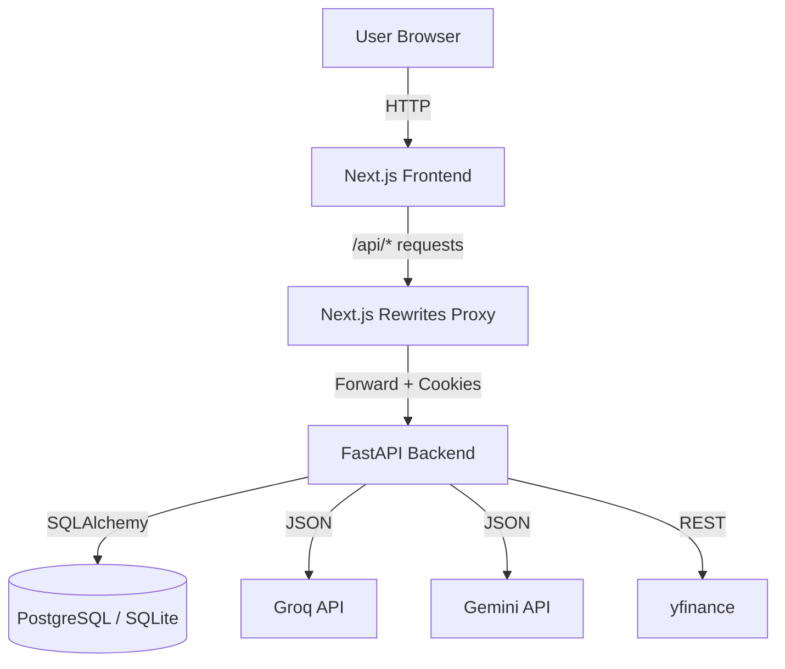

# Architecture Overview

VinSight follows a modern **Client-Server Architecture** with a **Proxy Layer** for cookie handling.

## Diagram

## Components

### Frontend (`/frontend`)
- **Framework**: Next.js 16 (App Router)
- **Styling**: TailwindCSS
- **State**: React Context (AuthContext, ThemeContext)
- **Charts**: Lightweight-charts
- **Proxy**: `next.config.js` rewrites `/api/*` to backend

### Backend (`/backend`)
- **Framework**: FastAPI
- **ORM**: SQLAlchemy
- **Validation**: Pydantic models
- **Config**: `redirect_slashes=False` for proxy compatibility

### Database
- **Users Table**: Stores user info, hashed passwords, alert limits.
- **Watchlists Table**: User watchlists with comma-separated tickers.
- **Alerts Table**: Price alert triggers configured by users.
- **Stocks Table**: Metadata about symbols.
