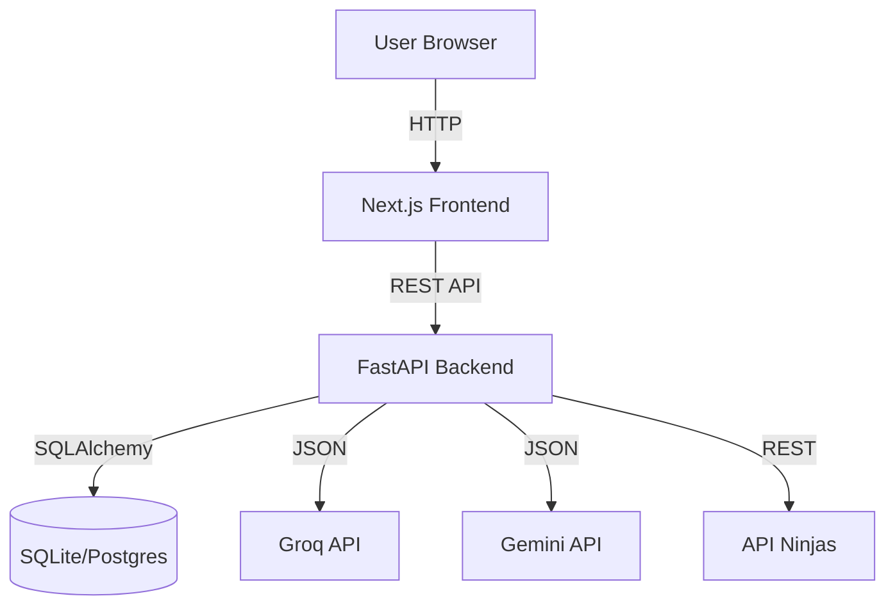

# Architecture Overview

VinSight follows a modern **Client-Server Architecture**.

## Diagram

## Components

### Frontend (`/frontend`)
- **Framework**: Next.js 14 (App Router)
- **Styling**: TailwindCSS
- **State**: React Context (AuthContext, ThemeContext)
- **Charts**: Lightweight-charts

### Backend (`/backend`)
- **Framework**: FastAPI
- **ORM**: SQLAlchemy
- **Validation**: Pydantic models
- **Scheduler**: Apscheduler (for background stock checks)

### Database
- **Users Table**: Stores generic user info and hashed passwords.
- **Stocks Table**: Metadata about symbols.
- **Alerts Table**: Triggers configured by users.
- **Prices Table**: Historical cache.
