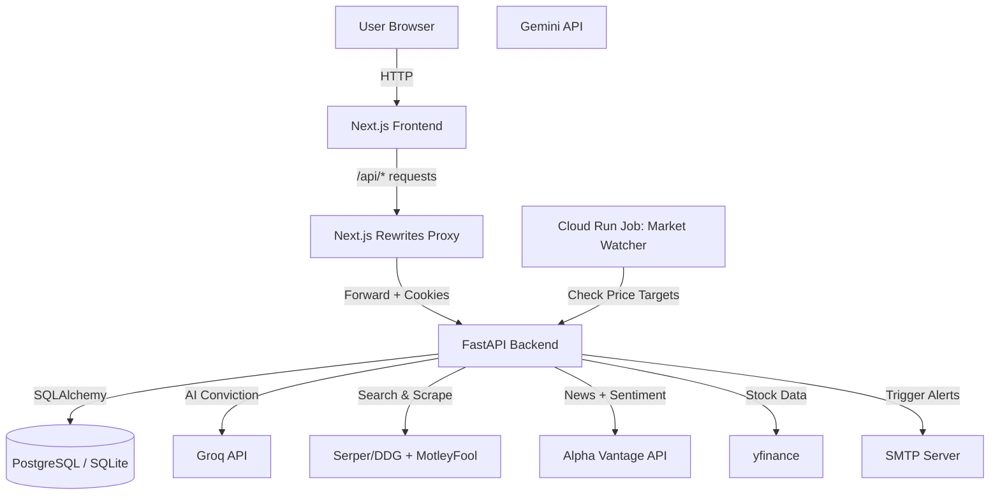

# Architecture Overview

VinSight follows a modern **Client-Server Architecture** with a **Proxy Layer** for cookie handling and a micro-batching background worker for market alerts.

## 1. System Diagram

## 2. Tech Stack

| Layer | Technology |
| :--- | :--- |
| **Frontend** | Next.js 14/15, TypeScript, Tailwind CSS, Framer Motion |
| **Backend** | Python 3.11, FastAPI, Pydantic, SQLAlchemy |
| **Database** | Cloud SQL (PostgreSQL 15) for Prod; SQLite for Local |
| **AI Models** | Groq (Llama 3.3 70B), Gemini 1.5 Pro, Alpha Vantage |
| **Email** | FAST-Mail (SMTP/Gmail) |
| **Infrastructure** | Google Cloud Run, Cloud Scheduler, Secret Manager |

## 3. Core Engine Logic
- **[VinSight Scoring Engine](./SCORING_ENGINE.md)**: Detailed breakdown of the Dynamic Benchmark Model (v9.0), Weighting profiles, and Vetos.
- **AI vs. Algo Separation**: The system decouples the **LLM's qualitative reasoning** (top briefing) from the **algorithmic quantitative baseline** (bottom breakdown), providing users with both objective metrics and subjective analyst thesis.

## 4. Infrastructure & Security
- **Computing**: Scaling-to-zero Cloud Run containers for cost efficiency.
- **Secrets**: Zero-knowledge credential storage via Google Secret Manager.
- **Alerts**: Background cron job (Worker) triggered every 5 minutes during US market hours.

## 5. Detailed Technical Documentation
- **[Security & Compliance](./SECURITY.md)**: OWASP compliance, Encryption audits, and Rotation schedules.
- **[Maintenance & Incident Log](./MAINTENANCE_LOG.md)**: Fix history and Root Cause Analyses.
- **[Deployment Guide](./DEPLOY.md)**: Instructions for pushing to Google Cloud.
- **[Setup Guide](./SETUP.md)**: Local development environment configuration.

