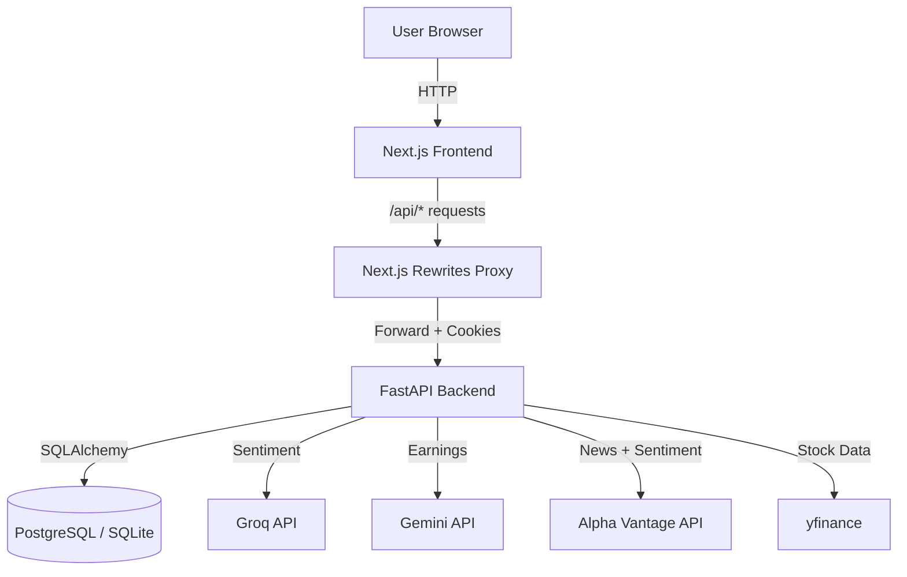

# Architecture Overview

VinSight follows a modern **Client-Server Architecture** with a **Proxy Layer** for cookie handling.

## Diagram

## Components

### Frontend (`/frontend`)
- **Framework**: Next.js 16 (App Router)
- **Styling**: TailwindCSS
- **State**: React Context (AuthContext, ThemeContext)
- **Charts**: Lightweight-charts
- **Proxy**: `next.config.js` rewrites `/api/*` to backend

### Backend (`/backend`)
- **Framework**: FastAPI
- **ORM**: SQLAlchemy
- **Validation**: Pydantic models
- **Config**: `redirect_slashes=False` for proxy compatibility

### AI Services (v6.1)
| Service | Purpose | Fallback |
|---------|---------|----------|
| **Alpha Vantage** | News sentiment (pre-scored) | Groq |
| **Groq (Llama 3.3 70B)** | Deep headline analysis | TextBlob |
| **Finnhub** | Insider MSPR sentiment | yfinance |
| **Gemini** | Earnings report analysis | - |

### VinSight Scoring Engine (v6.1)
| Pillar | Points | Focus |
|--------|--------|-------|
| **Fundamentals** | 60 | Valuation, Growth, Margins, Debt, Institutional |
| **Sentiment** | 15 | News + Insider Activity |
| **Projections** | 15 | Monte Carlo Simulation |
| **Technicals** | 10 | SMA, RSI, Volume |

**Sector Benchmarks**: 29 industry-specific thresholds in `backend/config/sector_benchmarks.json`

### Database
- **Users Table**: Stores user info, hashed passwords, alert limits.
- **Watchlists Table**: User watchlists with comma-separated tickers.
- **Alerts Table**: Price alert triggers configured by users.
- **Stocks Table**: Metadata about symbols.

