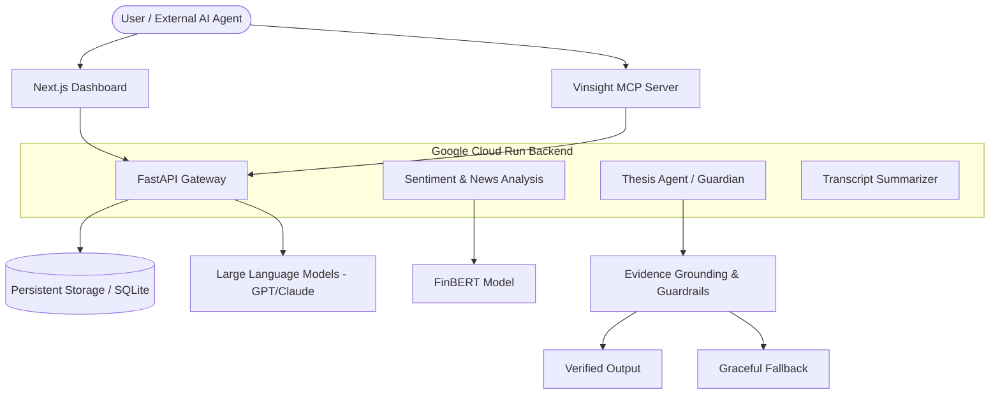
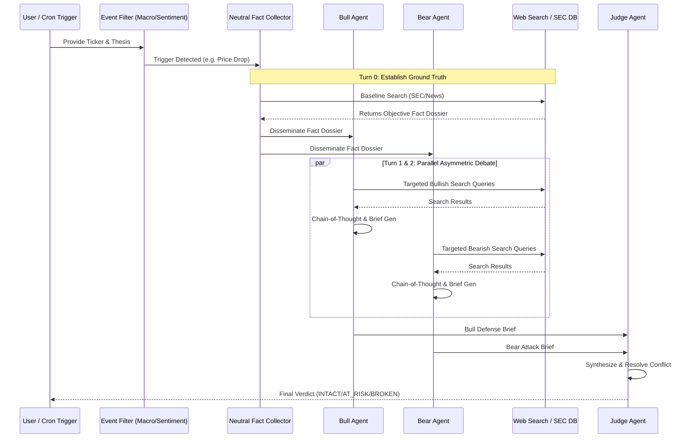

# Vinsight: Comprehensive Technical & Product Design Report
*A Foundation Document for Technical Presentations and Team Pitching*

---

## 1. Introduction & Project Scope
**Vinsight** is an AI-native financial intelligence platform designed to address the challenges of information overload and cognitive bias in modern investment research. While the platform encompasses a suite of services, the primary focus is the **Thesis Agent** (formerly Guardian Agent), supported by high-performance auxiliary services for **Sentiment Analysis** and **Earnings Transcript Summarization**.

### 1.1 The Thesis Agent (Core Pillar)
The "Hero" of the Vinsight ecosystem is an autonomous AI agent tasked with the rigorous validation of investment hypotheses. It doesn't just synthesize data; it acts as a "Guardian" against confirmation bias by actively searching for contradictory evidence and pressure-testing a user's trade idea against real-market signals.

### 1.2 Auxiliary AI Services
*   **Sentiment & News Analysis:** Real-time processing of financial news streams using domain-specific NLP models.
*   **Transcript Summarization:** Automated extraction of critical fundamental data and management sentiment from dense quarterly earnings calls.

---

## 2. Project Rationale & Rubric Alignment

### 2.1 Topic Choice and Scope
Vinsight is positioned as a specialized "AI co-pilot." By narrowing the scope from "general market prediction" to "investment thesis validation," the project achieves technical depth and high practical utility.

### 2.2 Potential Impact & Real-World Use Cases
The platform serves retail investors and professional analysts by reducing the time-to-insight. Its primary impact lies in **de-biasing investment decisions** and automating the "scut work" of parsing thousands of pages of text daily.

---

## 3. System Design & Technical Architecture

### 3.1 High-Level Architecture
Vinsight employs a decoupled architecture consisting of a Next.js frontend and a serverless Python backend deployed on Google Cloud Run. 

### 3.2 The Model Context Protocol (MCP) Integration
Vinsight is designed as a **Headless Intelligence Layer**. By implementing a specialized **MCP Server** (`backend/mcp_server.py`), the platform exposes its reasoning capabilities to the broader agentic ecosystem.

*   **Agents as Clients:** Any external agent (e.g., an automated trading bot or a general-purpose LLM) can connect to the Vinsight MCP server to retrieve sentiment scores or request a thesis evaluation.
*   **M2M Intelligence:** This enables machine-to-machine (M2M) communication where Vinsight serves as an "expert advisor" to other autonomous systems.

### 3.3 Thesis Agent Logic (Multi-Agent Debate)
The Thesis Agent employs an **Asymmetric Escalation Debate Architecture** (The "Independent Counsels" approach), strictly governed by grounding rules to prevent hallucinations and bounded by a hard cap on escalation turns (Max 2 turns) to control costs.

### 3.4 Architecture Decision & Rationale: Asymmetric Escalation Debate

During development, the underlying architecture of the Thesis Agent was upgraded from a sequential, single-agent loop to a **Parallel Multi-Agent Debate** model. 

**The Problem with Single-Agent Loops:**
Standard ReAct agents suffer from "sycophancy" (agreeing with the user's initial premise) and often fall into infinite search loops attempting to find the "perfect" piece of data to confirm a bias. Additionally, sequential searches (e.g., search -> read -> search again) resulted in unacceptable latency.

**The Solution & Rationale:**
1. **Sycophancy Eradication:** By forcing the `BULL` and `BEAR` agents to adopt extreme, diametrically opposed personas, we eliminate the AI's tendency to hedge. The Bear *must* attack; the Bull *must* defend.
2. **Deterministic Bounding (Cost/Infinite Loops):** The debate is strictly hard-capped at a maximum of 2 escalation turns (with 1 turn heavily preferred). Limiting the agent to 4 maximum API calls bounds the financial cost while forcing the agents to prioritize the highest-impact search queries.
3. **Parallel Latency Reduction:** Because the Bull and Bear run in parallel threads (`concurrent.futures`), the system executes two distinct deep-dive research workflows in the time it takes to run a single sequential turn.
4. **The "Judge" Synthesis:** Since the Bull and Bear are retrieving aggressively biased (and sometimes conflicting) web snippets, they cannot be trusted to rule on the final thesis safely. A neutral `Judge Agent` acts as the final arbiter, parsing both briefs to determine the objective truth and prevent hallucinations.

---

## 4. Technical Implementation Details

### 4.1 AI Guardrails & Reliability
*   **Hallucination Prevention:** The system enforces **Evidence Grounding**, requiring the LLM to cite specific news items or data points before making an assertion.
*   **Graceful Degradation:** A robust fallback system ensures that if the structured AI generation fails, the platform reverts to reliable legacy market data rather than displaying errors.
*   **Infrastructure:** Global state management via FastAPI and SQLite, with throttled job processing to ensure API stability under load.

### 4.2 Sentiment Analysis Methodology
Vinsight utilizes **FinBERT**, a BERT model pre-trained on a massive corpus of financial documents. This allows for superior nuance in detecting "Bullish" vs "Bearish" sentiment compared to general-purpose sentiment libraries.

### 4.3 Deep AI Personalization & User Modeling
Vinsight moves beyond generic market analysis by ingesting a structured **User Profile** (Risk Appetite, Investment Horizon, Monthly Budget, and Target Financial Goals) directly into its LLM context windows.
*   **Fiduciary Bounding:** The `ReasoningScorer` dynamically applies a `contextual_adjustment` penalty if a stock's volatility profile mathematically misaligns with the user's tight time horizon or low risk tolerance.
*   **Goal-Based Risk Assessment:** The Guardian Agent's "Bear Attack" brief specifically evaluates whether a deteriorating stock thesis jeopardizes the user's explicit `$X target by Year Y` goals, generating a uniquely personalized risk alert rather than a generic market warning.
*   **Robust Extraction:** LLM output is parsed through a resilient `_extract_json` pipeline that aggressively strips markdown backticks and `<think>` reasoning tags, ensuring structural stability even when reasoning models hallucinate formatting.

---

## 5. Design Philosophy: Why Markdown (.md)?
Markdown was selected as the primary documentation standard for Vinsight for its technical efficiency:
1.  **Git-Native:** Enables granular version control and code review of documentation alongside the codebase.
2.  **Embedded Logic:** Supports **Mermaid** for "diagrams as code," ensuring system designs are never out of sync with reality.
3.  **Portability:** Instantly convertible to HTML, PDF, or presentations while remaining human-readable in its raw form.

---

## 6. Evaluation Summary
Vinsight satisfies the project rubric by demonstrating:
*   **Technical Depth:** Multi-model pipelines (FinBERT + LLMs) and protocol implementation (MCP).
*   **Storytelling:** A clear transition from problem (bias/overload) to solution (agentic validation).
*   **Impact:** A clear path toward institutional and retail adoption as a "Brain Extension" for investors.
