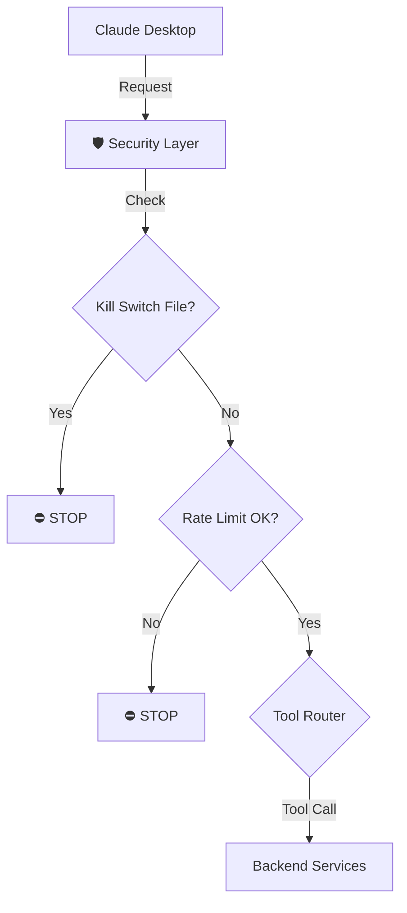
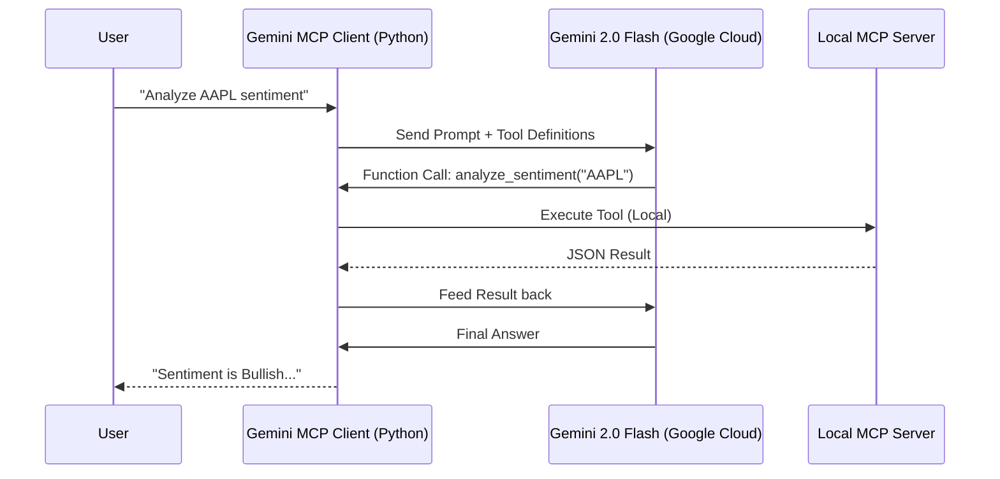

# VinSight MCP Server Manual

**Turn VinSight into an Agentic AI Tool.**

## 1. Quick Start (Claude Desktop)

To let Claude Desktop use VinSight:

1.  **Locate Config**: Open `~/Library/Application Support/Claude/claude_desktop_config.json`.
2.  **Add Server**:
    ```json
    {
      "mcpServers": {
        "vinsight": {
          "command": "python3",
          "args": ["/Users/vinayak/Documents/Antigravity/Project 1/backend/mcp_server.py"]
        }
      }
    }
    ```
3.  **Restart Claude**: Completely quit and reopen Claude Desktop.
4.  **Verify**: Look for the electric plug icon 🔌 in Claude. It should say "Connected to 1 server".

---

## 2. Architecture & Safety
### 2.1 Standard Flow (Claude Desktop)


### 2.2 Custom Gemini Flow (Python CLI)
Since Gemini Web doesn't support local MCP yet, we built a bridge:


### 2.3 Safety Core
The MCP Server sits between the Client and your Backend.


### Global Kill Switch
If the AI goes rogue or costs spike:
1.  **Action**: Run `python backend/manage_kill_switch.py on` (or create `mcp_kill_switch.lock`).
2.  **Effect**: All tools immediately stop working. Returns "Service Suspended".
3.  **Restore**: Run `python backend/manage_kill_switch.py off`.

### Safety Limits (Persistent)
To prevent API cost overruns, we enforce strict limits that **persist** even if you restart the server:
*   **Global Limit**: Max **100 calls per day** (24h rolling window).
*   **Hourly Tool Limits**:
    *   Sentiment Analysis: 60/hr
    *   Monte Carlo: 100/hr
    *   Earnings Analysis: 10/hr

---

## 3. Logs & Auditing
Logs are stored in `backend/logs/mcp_server.log`.

**We Log:**
- Timestamp & Tool Name
- Target Ticker (Sanitized)
- Execution Duration
- Success/Failure Status

**We Do NOT Log:**
- Full Prompt Text (Privacy)
- Full API Keys (Security)
- Massive JSON payloads (Disk Space)

**Exploit Prevention**:
- **Log Injection**: We strip newlines from inputs before logging.
- **Disk DoS**: Logs rotate automatically at 10MB (Max 5 backups).

---

## 4. Troubleshooting
**"Tool Error: Connection Refused"**
- Ensure you have run `pip install mcp` in your environment.
- Check `backend/logs/mcp_server.log` for startups errors.

**"Rate Limited" or "DAILY_LIMIT_EXCEEDED"**
- You have hit a safety cap.
- **Hourly Limit**: Wait for the rolling hour to pass.
- **Daily Limit**: You cannot make more calls until the 24h window resets.
- *Admin Override*: Delete `backend/logs/mcp_limits.json` to manually reset (Use with caution).
