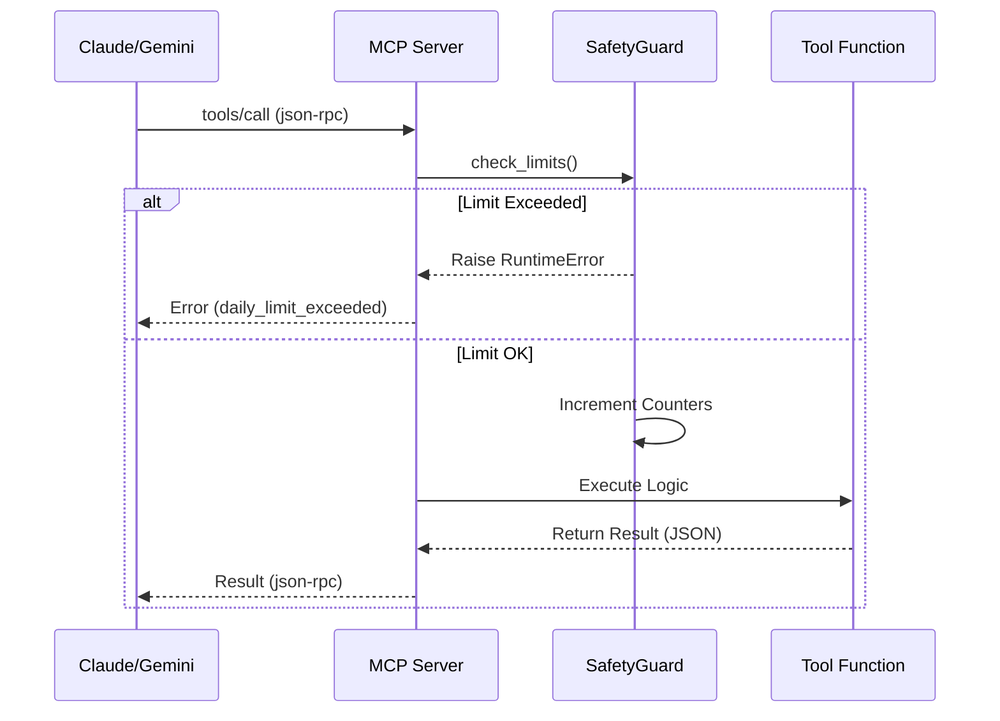

# VinSight MCP Server: Technical Reference

**Version**: 1.0.0
**Status**: Production-Ready
**Owner**: AI Engineering Team

## 1. Executive Summary
This document defines the architecture, security protocols, and operational standards for the VinSight Model Context Protocol (MCP) Server. This server acts as the **bi-directional bridge** between the VinSight Backend (SQLAlchemy/FastAPI) and external Agentic Clients (Claude Desktop, IDEs).

---

## 2. Architecture Overview

### 2.1 System Context
The MCP Server operates as a **Sidecar Process** to the main backend. It does not replace the FastAPI server but imports the same service logic to expose it via the MCP standard.

```mermaid
graph TD
    subgraph "External World"
        Client[Claude Desktop / Agent]
        Network[Internet]
    end

    subgraph "VinSight Infrastructure"
        direction TB
        MCPServer[MCP Server Process (stdio)]
        DB[(PostgreSQL/SQLite)]
        Services[Service Layer]
        
        Client <-->|Stdio / SSE| MCPServer
        MCPServer -->|Import| Services
        Services -->|Query| DB
        Services -->|HTTP| Network
    end
```

### 2.2 Core Components
1.  **Transport Layer**: `FastMCP` (stdio mode). Standard Input/Output for local desktop integration.
2.  **Safety Guard**: Application-layer firewall enforcing Rate Limits and Kill Switch state.
3.  **Tool Router**: Maps string-based tool calls (`analyze_sentiment`) to Python functions.
4.  **Service Integration**: Direct calls to `backend/services/` modules (Reusing `groq_sentiment`, `simulation`, `earnings`).

### 2.3 Interaction Flow (Sequence)


---

## 3. Security Specification
**Risk Profile**: High (LLM Agents can trigger costly loops or hallucinate actions).
**Mitigation Strategy**: "Defense in Depth".

### 3.1 The Global Kill Switch
*   **Mechanism**: File-existence check (`mcp_kill_switch.lock`).
*   **Behavior**: Atomic. If file exists, **all** requests return `RuntimeError`.
*   **Latency**: Zero-latency (File system check per request).
*   **Recovery**: Manual administrative action (delete file).

### 3.2 Rate Limiting (Persistent & Hourly)
Implemented with a persistent JSON store (`logs/mcp_limits.json`) to track usage across restarts.

**Global Safe-Guards:**
*   **Daily Global Limit**: Max **100 calls** per 24 hours (across all tools).
*   **Hourly Tool Limits**:
    *   `analyze_sentiment`: 60/hour.
    *   `run_monte_carlo`: 100/hour.
    *   `analyze_earnings`: 10/hour.

### 3.3 Protocol Deep Dive (JSON-RPC)
for Developers/CTOs asking: *"What actually happens on the wire?"*

**1. Discovery (The Handshake)**
Claude starts the script and sends:
```json
{"jsonrpc": "2.0", "method": "initialize", "id": 1, "params": {...}}
```
The Server responds with its capabilities and tool definitions.

**2. The Call (Agent -> Server)**
When the Agent wants to run a Monte Carlo sim, it sends:
```json
{
  "jsonrpc": "2.0", 
  "method": "tools/call", 
  "id": 2, 
  "params": {
    "name": "run_monte_carlo",
    "arguments": {"ticker": "TSLA"}
  }
}
```

**3. The Result (Server -> Agent)**
The Server executes the Python function and returns:
```json
{
  "jsonrpc": "2.0", 
  "id": 2, 
  "result": {
    "content": [{"type": "text", "text": "{\"p50\": 120.5, ...}"}]
  }
}
```

### 3.4 Error Standardization
All tools return structured JSON on failure:
```json
{
  "error": "Global limit of 100 calls reached.",
  "code": "DAILY_LIMIT_EXCEEDED",
  "status": "failed"
}
```

---

## 6. Connectivity Guide

### 6.1 Local Access (Stdio)
*   **Usage**: Claude Desktop, Cursor, Local Scripts.
*   **Method**: The client launches the server via `python mcp_server.py` and communicates over Standard Input/Output (stdin/stdout).
*   **Security**: High. Only the local user can interact.

### 6.2 Remote Access (SSE)
*   **Usage**: Remote Agents, OpenAI/Gemini Webhooks (requires relay).
*   **Method**: Server Sent Events (SSE) over HTTP.
*   **Setup**: Requires running the server with `mcp run ... --transport sse`.
*   **Warning**: This exposes your local machine to the network. Use a reverse proxy (ngrok) and strict auth if attempting this.

---

## 7. Cost Analysis (Worst-Case Scenario)
**Assumption**: Global limit of **100 calls/day** is fully utilized by the most expensive tools.

| Tool | Cost/Call (Est.) | Daily Max (100 calls) | Notes |
| :--- | :--- | :--- | :--- |
| `analyze_earnings` | ~$0.05 | **$5.00** | Large Context (Transcripts) |
| `get_portfolio_summary` | ~$0.02 | **$2.00** | DeepSeek R1 / Gemini Flash |
| `analyze_sentiment` | <$0.01 | **<$1.00** | News Headers only |
| **Combined Worst Case** | - | **~$5.00 / day** | If spamming earnings calls. |

**Protection**: The **Global Kill Switch** and **Hourly Limits** prevent this from spiraling beyond $5/day.

---

## 8. FAQ: Is this "Omni"?
**Q: Is this an "Omni Agent" implementation?**
**A: Yes, in the architectural sense.**
*   **Universal Protocol**: This server uses **MCP (Model Context Protocol)**, which is the open standard for connecting AI models to data.
*   **Agent Agnostic**: It works with **Claude**, **OpenAI (via bridge)**, **Gemini**, and future "Omni" models.
*   **Multi-Modal Ready**: The architecture supports text, but is ready to handle images/audio if you extend the tools.

