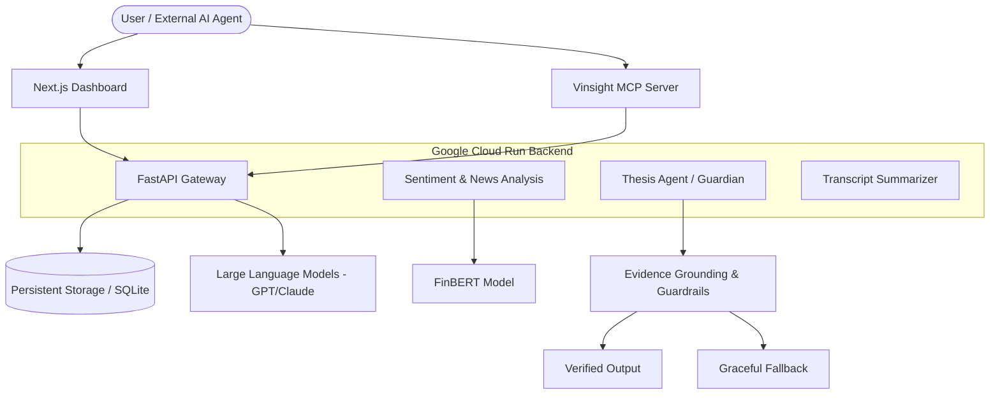
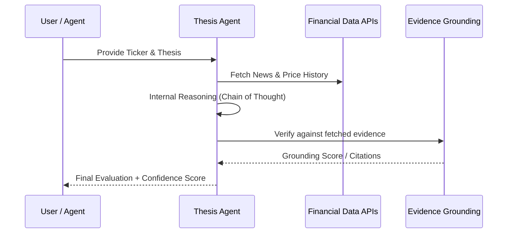

# Vinsight: Tech, Product, and System Design Document
*Reference Document for MSIS 521 Course Project Pitch & Presentation*

## 1. Executive Summary & Project Intro
**Vinsight** is an advanced AI-powered financial intelligence platform designed to synthesize and analyze complex market data. The core innovation of Vinsight is the **Thesis Agent** (formerly known as the Guardian Agent), an autonomous AI agent that pressure-tests and guards investment theses by cross-referencing them against real-time market sentiment, fundamental data, and technical analysis. In addition to the Thesis Agent, Vinsight features powerful auxiliary microservices, including **Financial News Sentiment Analysis** and **Earnings Transcript Summarization**.

---

## 2. Topic Choice, Scope, and Interest (Rubric Area 1)
**How to Pitch This in the Presentation:** Emphasize that the topic is highly focused and deeply relevant to modern finance. It's not a generic AI wrapper; it's a specialized tool.
* **Clear Definition:** Vinsight is an "AI co-pilot for investment validation." It actively evaluates a user's investment hypothesis.
* **Appropriate Scope:** Predicting the stock market is too broad. We scoped the project intelligently by focusing on *augmenting research*—summarizing vast documents and evaluating an existing thesis to save time.
* **Creative Angle:** The concept of a "Thesis Agent" that acts as a devil’s advocate/guardian for an investor’s ideas, combating human confirmation bias.

---

## 3. Potential Impact and Relevance (Rubric Area 2)
**How to Pitch This in the Presentation:** Highlight the real-world business application. Who uses this and why?
* **Target Audience:** Retail investors, portfolio managers, and financial analysts in hedge funds or asset management firms. 
* **The Business Problem:** Information overload and cognitive bias. Analysts spend 80% of their time reading earnings call transcripts and parsing news, leaving limited time for actual decision making.
* **Real-World Impact:** The Thesis Agent condenses hours of reading into seconds of synthesis. By forcing an investment thesis through an objective, evidence-grounded AI evaluation, it limits emotional trading and reduces research friction. This translates directly to saved institutional hours and better trading outcomes.

---

## 4. System Design & Technical Architecture (Rubric Area 3)
**How to Pitch This in the Presentation:** Showcase technical depth, emphasizing that you handled edge cases, used appropriate models, and evaluated outputs.

### A. High-Level System Architecture
The following diagram illustrates the flow from data acquisition to agentic reasoning and user delivery.

### B. Core AI Implementations & Agentic Logic
1. **The Thesis Agent (The Hero Feature):**
   * **Role:** Takes a user's investment thesis and stock ticker, and rigorously evaluates it for validity.
   * **Reasoning Flow:**

   * **Guardrails & Engineering:** Implemented strict AI guardrails to ensure accuracy and limit hallucinations. The agent requires **Evidence Grounding** to assign a confidence score. 
   * **Reasoning Optimization:** Intelligently manages context length by capping background database storage while surfacing the full reasoning flow to the user on the frontend.
   * **Reliability Engineering:** Built-in rate limiters (5-second throttle) between thesis processes and a robust logging system to audit the agent's thought process.

2. **News Sentiment Analysis Service:**
   * **Method:** Utilizes specialized NLP models (like FinBERT) pre-trained exclusively on financial lexicon to scan historical and live news headlines. 
   * **Function:** Classifies sentiment (Bullish, Bearish, Neutral) and correlates it directly with stock price movements (Event Study).

3. **Earnings Transcript Summarization:**
   * **Method:** LLM-driven generative summarization.
   * **Function:** Parses massive, dense quarterly earnings call transcripts, instantly extracting key fundamental metrics, management guidance, and overall tone.

---

## 5. Model Context Protocol (MCP) & Agents as Clients
**The NEXT Evolution of Vinsight: Machine-to-Machine Intelligence**

Vinsight is not just a dashboard for humans; it is a **Headless Intelligence Layer**. We have implemented a **Model Context Protocol (MCP) Server** that allows other AI agents (like Claude, GPT-4, or custom trading bots) to use Vinsight as a "Brain Extension."

* **Why it matters:** In the future, investment decisions won't just be made by humans. They will be made by agents. Our MCP server exposes Vinsight's Thesis Agent and Sentiment analysis as "Tools" that any other agent can call.
* **Architecture:** 
    * **Server-to-Server:** A trading agent can "call" our MCP server to get a sanity check on a trade before executing.
    * **Standardized Protocol:** By using MCP, Vinsight becomes part of the global agentic ecosystem.

---

## 6. Presentation & Storytelling Strategy (Rubric Area 4)
*Structure your slide deck using the recommended logical story arc. Target ~10-12 slides total.*

* **Slide 1: Title & Hook** - Introduce Vinsight and the team.
* **Slide 2: The Context** - The state of modern investing. The market moves faster than a human can read.
* **Slide 3: The Problem** - Analysts suffer from information overload and confirmation bias. They need an objective partner to pressure-test their ideas.
* **Slide 4: The Data** - Where Vinsight draws its truth (Financial news, complex earnings transcripts, API market metrics).
* **Slide 5: The Solution (Vinsight Overview)** - Introduce the platform and our three pillars: The Thesis Agent, News Sentiment, and Transcript Summarization.
* **Slide 7: Technical Pipeline & Agentic Ecosystem** - 
  * Show the System Architecture diagram.
  * Explain the **MCP Integration**: Vinsight as a service for *other* agents. This is a massive "Bonus Point" for tech depth.
  * Talk about the **Guardrails**: Hallucination prevention, evidence grounding, and graceful fallbacks.
* **Slide 8-9: The Demo (The Climax)** - 
  * *Keep it visually clear.* Show a user entering a thesis -> The Agent analyzing -> The final Confidence Score and highlighted news sentiment. 
* **Slide 10: Real-World Impact** - Reiterate the business case. Time saved, better decisions, and debiased investing.
* **Slide 11: Conclusion & Q&A** - Wrap up and open the floor.

### Pro-Tips for Delivering the Pitch:
* **Share the Stage:** Divide speaking roles logically. Have one person cover the business context/impact, and another cover the technical architecture and demo.
* **Visuals over Text:** Avoid text-heavy slides. Use diagrams for the architecture and large screenshots for the demo.
* **Connect Tech to Value:** Whenever discussing a technical feature (e.g., "We used Guardrails and evidence grounding"), immediately explain *why* it matters (e.g., "...because in finance, a hallucinated number costs money").

---

## Appendix: Why Markdown (.md)?
We chose Markdown for our core documentation for three strategic reasons:
1. **Version Control Integration:** Unlike Word or PDFs, `.md` files allow us to track every single change in Git, ensuring the documentation evolves alongside the code.
2. **Mermaid Diagram Support:** Markdown natively renders technical diagrams (like the ones in this doc), keeping our architecture docs "live" and editable.
3. **Universally Readable:** Markdown can be instantly converted to professional PDFs, HTML presentations, or Wiki pages, making it the perfect "Single Source of Truth."
