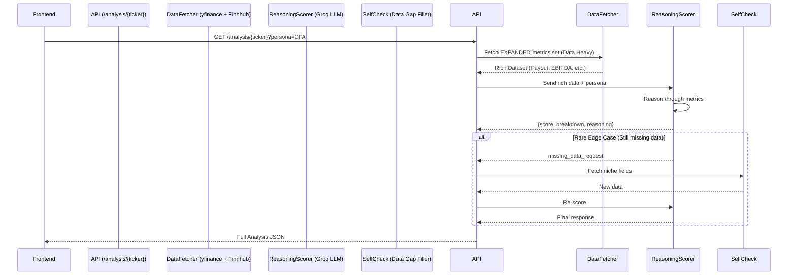

# AI-Driven Reasoning Scorer: Implementation Plan

**Date:** February 03, 2026  
**Scope:** Replace formula-based `VinSightScorer` with `ReasoningScorer` supporting **Hybrid Providers** (Gemini 1.5 Flash + Llama 3.3).  
**Status:** Approved - Execution Phase

---

## 1. Problem Statement

The current scorer uses a **hardcoded formula** (70% Quality + 30% Timing) with fixed weights and thresholds. This lacks:

| Limitation | Impact |
| :--- | :--- |
| **Static Logic** | Cannot adapt to regime changes (e.g., rate hikes favor FCF, not growth). |
| **No Reasoning Transparency** | Users see a score but not _why_ those weights matter. |
| **Single Persona** | All users are treated as "balanced CFA" without option for aggressive/defensive. |
| **Benchmark Mismatch** | A REIT judged by Tech margins will always look bad. |
| **Data Gaps Silent** | Missing data scores as 0 pts without attempt to fill. |

---

## 2. Proposed Solution: Reasoning Scorer

> An LLM-powered scorer that **reasons** through the data, explains its weighting choices, self-checks for missing data, and adapts to the selected **Persona** and **Benchmark**.

### Flow Diagram



---

## 3. Key Design Decisions

### 3.0 [IMPORTANT] Data Provenance & LLM Role

> **"The LLM is the Judge, not the Witness."**

*   **Is data coming from the LLM?**  
    **NO.** The LLM (Gemini 1.5 Flash) is **never** asked to retrieve stock prices or financials from its training data.
*   **Where does data come from?**  
    All data is fetched from **yfinance** (Live Prices, History) and **Finnhub** (Insider, Sentiment) *before* the prompt is built.
*   **Do we need more data?**  
    **YES, UPFRONT.** To minimize latency, we will fetch a **Superset of Metrics** (Data Heavy) initially. This "Over-Fetch" strategy ensures the LLM usually has everything it needs in one shot.

    **New Metrics to Add:**
    *   **Income:** `payoutRatio`, `fiveYearAvgDividendYield`, `trailingAnnualDividendYield`.
    *   **Value:** `priceToBook` (P/B), `priceToSalesTrailing12Months` (P/S), `enterpriseToEbitda` (EV/EBITDA), `enterpriseToRevenue`.
    *   **Momentum:** `shortRatio`, `fiftyTwoWeekChange` (vs S&P500).
    *   **Growth:** `revenueGrowth` (YoY), `earningsQuarterlyGrowth`.
    
    > **Note on Insiders:** As requested, we will **ONLY** fetch/consider **Insider Buying** signals. Selling is noisy and often for tax reasons; Buying is the only true signal.

    **Qualitative Data:**
    *   **Earnings Call Analysis:** Fetch cached earnings summary (Verdict, Sentiment) from `earnings.py`. If available, this gives the LLM insight into management confidence and hidden risks.
    *   **Monte Carlo Projections:** Include P10 (Downside Risk), P50 (Target), and P90 (Bull Case) from our existing simulation engine. The LLM should weigh "Risk/Reward Ratio" (Gain to P90 vs Loss to P10).

### 3.1 Personas

| Persona | Description | Priority Metrics |
| :--- | :--- | :--- |
| **CFA (Default)** | Balanced institutional analyst. Valuation + Quality. | PEG, ROE, Debt/EBITDA, FCF Yield |
| **Momentum Trader** | Technical focus. Price action > fundamentals. | RSI, SMA Trend, RVOL, Price vs High |
| **Income Investor** | Yield-focused. Capital preservation. | Div Yield, Payout Ratio, Interest Coverage |
| **Deep Value** | Contrarian. Seeks unloved stocks. | P/B, FCF Yield, Insider Buying |
| **Growth at Any Price** | Prioritizes revenue growth, tolerates high P/E. | Revenue CAGR, EPS Growth, TAM |

> [!IMPORTANT]
> Personas are **prompt configurations**, not new code paths. The LLM receives a "persona system prompt" that changes its weighting logic dynamically.

### 3.2 Self-Check / Data Gap Filler

If the LLM identifies a gap (e.g., "Interest Coverage is critical but missing"), the system will:

1.  Parse the LLM's `missing_data_request` array (e.g., `["interest_coverage", "debt_to_ebitda"]`).
2.  Call `finance.get_advanced_metrics()` or a direct yfinance fallback.
3.  Re-invoke the LLM with the complete data.
4.  Cap at 1 retry to avoid infinite loops.

### 3.3 Benchmark Integration

The scorer will receive the full benchmark config from [sector_benchmarks.json](file:///Users/vinayak/Documents/Antigravity/Project%201/backend/config/sector_benchmarks.json) for the selected sector. Example:

```json
{
  "sector": "💾 Semiconductors",
  "pe_median": 40,
  "peg_fair": 2.5,
  "growth_strong": 0.25,
  ...
}
```

The LLM will be instructed: "A P/E of 35 is **undervalued** for Semiconductors (median 40), but **overvalued** for Energy (median 12)."

---

## 4. Comparison: Current vs. Proposed

| Aspect | Current (`VinSightScorer`) | Proposed (`ReasoningScorer`) |
| :--- | :--- | :--- |
| **Scoring Logic** | Hardcoded formula: `0.7 * Quality + 0.3 * Timing` | LLM reasons through data dynamically |
| **Weights** | Fixed in Python code | LLM decides based on Persona |
| **Benchmarks** | Loaded from JSON, compared via linear interpolation | LLM told thresholds, decides significance |
| **Missing Data** | Logs to CSV, scores as 0 | LLM requests, system fills, re-scores |
| **Transparency** | Breakdown table only | Full reasoning paragraph + breakdown |
| **Persona Support** | None | CFA / Momentum / Income / Value / Growth |
| **Kill Switches** | Hardcoded (Insolvency, Downtrend vetoes) | LLM applies contextual severity |
| **Performance** | ~10ms (pure Python) | ~300-500ms (Groq API call, cacheable) |
### 4.0 Model Comparison & Strategy (GCP Context)

Since `VinSight` runs on **Cloud Run**, we prioritized specific factors:

| Feature | **Groq (Llama 3.3 70B)** | **Gemini 1.5 Flash** | **Gemini 1.5 Pro** |
| :--- | :--- | :--- | :--- |
| **Reasoning** | **Excellent**. Deep nuance, high accuracy. | **Very Good**. Efficient, great at structured tasks. | **SOTA**. Best for complex, ambiguous cases. |
| **Speed** | **~300ms**. (LPU hardware is unmatched). | **~500ms**. (Google TPU optimization). | **~3-5s**. Too slow for real-time UI. |
| **Integration** | External API (Public Internet). | **Native GCP** (Internal Google Network). | Native GCP. |
| **Cost** | Extremely Low. | **Free Tier** / Lowest Cost. | Moderate. |
| **Verdict** | Keep for **Quality Checks**. | **Visual Default**. Best for stability on GCP. | Use for **Generated Reports** only. |

### 4.1 Rationale: Why these models?

You asked: *"Will Flash be lower quality? Does it have reasoning?"*

1.  **Does Flash have Reasoning?**
    *   **Yes.** But it is "Lite" reasoning. It is excellent at following rules ("If P/E < 20 and Growth > 10%, score high"), but weaker at creative nuance ("The CEO sounded nervous about China").
    *   **Gemini 1.5 Pro** is the true "Reasoning Monster" (better than Llama), but it is **slow** (3-4s).

2.  **Llama 3.3 vs Flash**
    *   **Llama 3.3 70B** is a larger, "smarter" model than Flash. Groq makes it run fast.
    *   **Flash** is a smaller model optimized for speed.
    *   **Trade-off**: Flash integrates natively with your Google Cloud security/billing. Llama requires sending data to Groq (external).

3.  **The Strategy: "Hybrid Choice"**
    *   We will code the app to support **BOTH**.
    *   You can toggle `AI_PROVIDER=groq` or `AI_PROVIDER=gemini` in your `.env`.
    *   This gives you the freedom to choose: **Maximum Intelligence (Llama/Pro)** vs **Maximum Integration (Flash)**.

### 4.2 Hybrid Implementation Strategy

We will implement a **Provider Agnostic** scorer.
*   **Env Var**: `AI_PROVIDER=gemini` (Default) or `AI_PROVIDER=groq`.
*   **Logic**:
    *   If `gemini`: Uses `google.generativeai`. Fast, stable, native.
    *   If `groq`: Uses `groq` client. High-speed open-source alternative.

### 4.2 Page Load & Optimization Strategy

## 5. Proposed Changes

### Backend

---

#### [NEW] [reasoning_scorer.py](file:///Users/vinayak/Documents/Antigravity/Project%201/backend/services/reasoning_scorer.py)

New class `ReasoningScorer` that:
-   **Dual Provider Support**:
    -   `_call_gemini()` using `google.generativeai`.
    -   `_call_groq()` using `groq` client.
-   Reads `LLM_PROVIDER` env var (default: `gemini`).
-   Accepts `StockData`, `persona`, `benchmark_name` as inputs.
-   Builds a structured prompt (shared across models).
-   Parses response: `{score, rating, breakdown: {}, reasoning, missing_data_request: []}`.

---

#### [MODIFY] [data.py](file:///Users/vinayak/Documents/Antigravity/Project%201/backend/routes/data.py)

-   Add query params to `/analysis/{ticker}`: `persona` (str, default="CFA"), `scoring_engine` (str, "formula" or "reasoning", default="reasoning").
-   Toggle between `VinSightScorer` (formula) and `ReasoningScorer` (LLM) based on `scoring_engine` param.
-   **Fetch Upgrade**: Enhance `get_technical_analysis` to fetch expanded metrics (payout, P/B, EBITDA) by default.

---

#### [MODIFY] [sector_benchmarks.json](file:///Users/vinayak/Documents/Antigravity/Project%201/backend/config/sector_benchmarks.json)

-   Add `description` field to _all_ sectors (some exist, ensure consistency).
-   Add `persona_notes` object with per-persona guidance (optional enhancement).

---

### Frontend

---

#### [MODIFY] [Dashboard.tsx](file:///Users/vinayak/Documents/Antigravity/Project%201/frontend/src/components/Dashboard.tsx)

-   Add **Persona Selector** dropdown next to existing Benchmark dropdown.
-   Add toggle switch: "Use AI Reasoning Scorer" (for A/B user testing during rollout).
-   Update `getAnalysis()` call to include `persona` and `scoring_engine` params.

---

## 6. Prompt Design (Deep Reasoning)

The system prompt will enforce a **Chain of Thought** process before outputting JSON.

```text
SYSTEM PROMPT:
You are a {persona} Equity Research Analyst.
Your goal is to evaluate {ticker} and assign a conviction score (0-100).

BENCHMARK CONTEXT ({benchmark_name}):
- Sector P/E Median: {bench_pe}
- Sector Margins: {bench_margin}
...

DATA INPUTS:
[Fundamentals]: {metrics_json}
[Technicals]: {tech_json}
[Projections]: {proj_json}
[Qualitative]: {earnings_summary_if_cached} (May be null)

REASONING GUIDELINES:
1. **Benchmark Relativism**: A P/E of 20 is "Cheap" if Benchmark is 30, but "Expensive" if Benchmark is 10.
2. **Conflict Resolution**: If Technicals say "Buy" but Fundamentals say "Rotting", prioritize based on your Persona ({persona}).
   - CFA: Trust Fundamentals.
   - Momentum: Trust Technicals.
3. **Qualitative Override**: If Earnings Call sentiment is "Bearish", PENALIZE the score even if numbers look okay.
4. **Efficiency**: Be concise but incisive.

OUTPUT FORMAT (JSON ONLY):
{
  "thought_process": "Step 1: Valuation is... Step 2: Technicals show... Step 3: Weighing conflict...",
  "score": <0-100>,
  "rating": "Strong Buy|Buy|Hold|Sell|Strong Sell",
  "breakdown": { "quality": <0-70>, "timing": <0-30> },
  "key_drivers": ["<Driver 1>", "<Driver 2>"],
  "missing_data_request": ["<field1>", "<field2>"] or [],
  "meta": {
    "source": "Live" or "Cache",
    "timestamp_pst": "YYYY-MM-DD HH:MM:SS PST"
  }
}
```

---

## 7. Verification Plan

### 7.1 Unit Tests

Existing tests in [test_vinsight_scorer_unit.py](file:///Users/vinayak/Documents/Antigravity/Project%201/backend/tests/test_vinsight_scorer_unit.py) cover the **formula scorer**. We need:

#### [NEW] tests/test_reasoning_scorer.py

Mock the Groq API to test:
1.  Prompt construction contains expected data fields.
2.  Parses valid JSON response correctly.
3.  Handles missing_data_request flow (calls _fill_data_gaps, re-invokes).
4.  Fallback to formula scorer on Groq error.

**Command to run:**
```bash
cd /Users/vinayak/Documents/Antigravity/Project\ 1/backend && pytest tests/test_reasoning_scorer.py -v
```

### 7.2 Integration Test (Manual API Call)

After implementation, run locally:

```bash
# Start backend
cd /Users/vinayak/Documents/Antigravity/Project\ 1 && ./run_local.sh

# Test formula scorer (baseline)
curl "http://localhost:8000/api/data/analysis/AAPL?scoring_engine=formula" | jq .ai_analysis.score

# Test reasoning scorer with CFA persona
curl "http://localhost:8000/api/data/analysis/AAPL?scoring_engine=reasoning&persona=CFA" | jq .ai_analysis

# Test reasoning scorer with Momentum persona
curl "http://localhost:8000/api/data/analysis/AAPL?scoring_engine=reasoning&persona=Momentum" | jq .ai_analysis.reasoning
```

**Expected Differences:**
-   CFA: Higher weight on valuation metrics, mentions PEG, ROE.
-   Momentum: Higher weight on RSI, SMA trend, mentions price action.

### 7.3 UI Verification (Browser)

1.  Navigate to `http://localhost:3000`.
2.  Select a stock (e.g., TSLA).
3.  Open "VinSight AI" tab.
4.  Change **Persona** dropdown to "Momentum Trader".
5.  Expected: Score changes, reasoning text reflects momentum focus.
6.  Change **Benchmark** dropdown to "🛢️ Energy Sector".
7.  Expected: Score changes (TSLA should score lower on Energy benchmarks).

### 7.4 User Sign-Off

> [!CAUTION]
> After implementation, request user to manually verify 3 tickers of their choice (1 tech, 1 stable dividend, 1 speculative) and confirm the reasoning makes sense for each persona.

---

## 8. Open Questions for User

1.  **Default Persona**: Should it be "CFA" or allow user to set a default in their profile?
2.  **Caching Duration**: 5 minutes per (ticker, persona, benchmark) seems reasonable. Any concerns?
3.  **A/B Toggle**: Should we show both formula and reasoning scores side-by-side for comparison during rollout?
4.  **Cost Monitoring**: Should we add Groq API usage logging to track calls?

---

## 9. Risk Mitigation

| Risk | Mitigation |
| :--- | :--- |
| Groq API downtime | Fallback to `VinSightScorer` formula automatically |
| LLM hallucination | Validate JSON schema; fallback on parse error |
| Rate limits | Cache aggressively; batch requests if possible |
| Latency | Show "Analyzing with AI..." spinner; cache hits are instant |
| Inconsistent scores | Temperature=0.1 for determinism; log all prompts/responses |

---

**Next Steps (Pending Approval):**
1.  Implement `ReasoningScorer` class.
2.  Update `data.py` routes.
3.  Add frontend Persona selector.
4.  Write unit tests.
5.  Deploy and A/B test.
