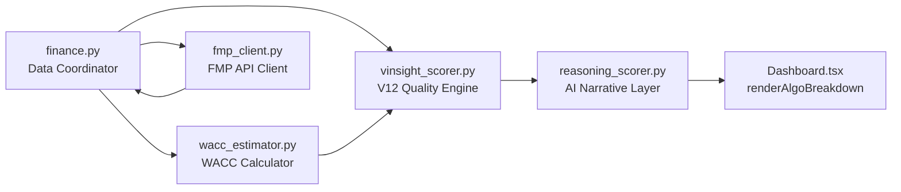

# V12 Engine — Technical Reference

## Architecture Overview

The V12 Engine is a hybrid intelligence scoring pipeline that combines quantitative modeling (Python) with qualitative AI reasoning (LLM). The Python engine computes a base score from fundamentals/technicals, then the LLM provides narrative analysis and a bounded ±10 point contextual adjustment.



## Scoring Pipeline

### 1. Data Extraction (`finance.py`)
- **Source:** Yahoo Finance (yfinance), FMP API
- **V12 Fields:** NOPAT, Invested Capital, OCF, Trailing EPS, Net Share Issuance, BVPS, Forward ROE
- **WACC:** Computed via CAPM: `Ke = Rf + β × ERP`, bounded [8%, 15%]

### 2. Quality Engine (`vinsight_scorer.py` v8.0)

#### Base Scoring (100 pts)
| Category | Metric | Max Pts |
|----------|--------|---------|
| Valuation | PEG Ratio | 20 |
| Valuation | Net Shareholder Yield | 15 |
| Profitability | ROE | 15 |
| Profitability | Net Margin | 10 |
| Capital Efficiency | ROIC Spread (ROIC − WACC) | 10 |
| Health | Debt/EBITDA | 15 |
| Health | Altman Z-Score | 5 |
| Growth/Stability | EPS Stability (CV) | 10 |

#### V12 Defensive Layer (Phase 1-2)
- **Accrual Ratio:** Flags when `(NOPAT − OCF) / Total Assets > 0.10` (earnings not backed by cash)
- **DuPont Decomposition:** Compares reported ROE vs decomposed `(NI/TA × TA/Equity)`
- **Share Dilution Kill Switch:** Fires when `Net Issuance / Market Cap > 5%`
- **ROIC Kill Switch:** Fires when `ROIC < WACC − 2%` (value destruction)
- **Data Fragility:** Confidence scoring based on data availability (High/Med/Low → 0/10/20 pt penalty)

#### RIM Valuation (Phase 3)
```
P* = BV₀ + Σ [(ROE_t − WACC) × BV_{t-1}] / (1 + WACC)^t
```
- 3-year explicit forecast with ROE mean-reversion fade (100% → 85% → 70%)
- Terminal value: zero (conservative — no terminal growth)
- **Skip condition:** P/B > 10x (asset-light companies where book value is structurally irrelevant)
- **P/B 5-10x:** Blends 50% BVPS + 50% intangible-adjusted anchor
- **Bonus/Penalty:** ±3 pts based on Margin of Safety (capped at ±15 pts)
- **WACC Sensitivity:** Reports IV at WACC±1%

#### Kill Switches (Hard Caps)
| Trigger | Cap |
|---------|-----|
| Interest Coverage < 1.5x | Score ≤ 40 |
| Altman Z < 1.8 | Score ≤ 20 |
| ROIC < WACC − 2% | Score ≤ 30 |

### 3. AI Narrative Layer (`reasoning_scorer.py` v12.0)
- **Prompt:** Receives Python engine results including V12 metrics (RIM IV, MoS, Kill Switches, Fragility)
- **Providers:** Anthropic → Groq → OpenRouter → DeepSeek → Gemini (failover chain)
- **Timeout:** 30s per provider, 180s frontend
- **Output:** Structured summary (verdict, bull_case, bear_case, fundamental_analysis, technical_analysis)
- **Adjustment:** ±10 pts bounded contextual adjustment with justification

## WACC Estimation (`wacc_estimator.py`)
- **Risk-Free Rate:** 10Y Treasury Yield (^TNX) via Yahoo Finance, fallback 4.0%
- **Equity Risk Premium:** Fixed 5.5% (Phase 1)
- **Beta:** From yfinance, capped [0, 3.0], defaulting to 1.0 if missing/NaN
- **Bounds:** WACC ∈ [8%, 15%]

## Test Coverage

| Test File | Tests | Type |
|-----------|-------|------|
| `tests/test_v12_scorer_unit.py` | 17 | Unit (mocked, no network) |
| `tests/test_wacc_estimator.py` | 8 | Unit (mocked) |
| `test_cfa_scorer.py` | 3 | Integration (backward compat) |
| `test_phase0.py` – `test_phase3.py` | ~20 | Integration (live data) |

Run all unit tests:
```bash
python3 -m pytest tests/ -v
```

---

## v13 Evolution: Three-Axis Architecture

> V12's Quality Engine has been restructured into three independent axes in v13. The V12 code remains backward-compatible via the `evaluate()` method.

### Architecture Change

| V12 | V13 |
|-----|-----|
| Quality Score (unified 0-100) | Quality (0-100) + Value (0-100) + Timing (0-100) |
| Single persona-weighted base | Persona conviction weights per axis (Q/V/T) |
| No valuation separation | Value axis: PEG, Fwd P/E, FCF Yield, RIM MoS |
| N/A | Guardian conviction modifiers (BROKEN→cap 40, AT_RISK→-10) |

### New Files (v13)

| File | Purpose |
|------|---------|
| `vinsight_scorer.py:evaluate_v13()` | Unified three-axis entry point |
| `data_provider.py` | `DataProvider` ABC for data-source abstraction |
| `backtest.py` | Empirical backtesting engine (scores at monthly snapshots) |

### Backtesting Results

Elite tier (score 80-100): **72% hit rate at 3mo**, **100% at 12mo**, **+7.4% excess return** vs SPY.

See [SCORING_ENGINE.md](./SCORING_ENGINE.md) for the current v13 scoring specification.

