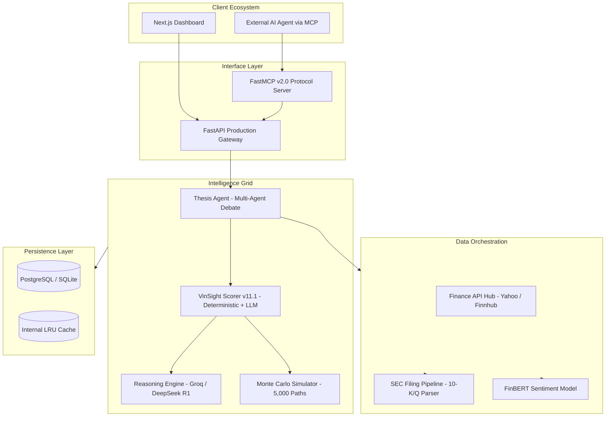

# Vinsight: Business & Technology Planning Document

**Version:** 1.0 | **Date:** March 13, 2026 | **Status:** Final  
**Website:** [vinsight.page](https://www.vinsight.page)

---

## Table of Contents

1. [Executive Summary](#1-executive-summary)
2. [Market Opportunity & Problem Statement](#2-market-opportunity--problem-statement)
3. [Competitive Landscape & Defensibility](#3-competitive-landscape--defensibility)
4. [Product & Core Capabilities](#4-product--core-capabilities)
5. [Technical Architecture & Engineering](#5-technical-architecture--engineering)
6. [Business Model & Unit Economics](#6-business-model--unit-economics)
7. [Go-To-Market Strategy](#7-go-to-market-strategy)
8. [Product Positioning by Segment](#8-product-positioning-by-segment)
9. [Organizational Design & CXO Functions](#9-organizational-design--cxo-functions)
10. [Governance, Risk & Compliance (GRC)](#10-governance-risk--compliance-grc)
11. [Product & Technology Roadmap](#11-product--technology-roadmap)
12. [KPIs, Metrics & Success Criteria](#12-kpis-metrics--success-criteria)
13. [Long-Term Vision](#13-long-term-vision)

---

<a name="1-executive-summary"></a>
## 1. Executive Summary

Vinsight is an AI-native financial intelligence platform that democratizes access to institutional-quality investment analysis. The platform combines multi-agent AI workflows, large-scale financial data aggregation, and intelligent orchestration to enable retail investors and financial advisors to access deep research insights previously available only to professional analysts on expensive terminals.

**The Core Insight:** Over the past two decades, financial technology has democratized *access to data*, but not the *synthesis of that data*. A retail investor can instantly pull a 200-page 10-K filing or scan 50 news articles, but processing that volume of information objectively is physically impossible for a human. As a result, investment decisions are frequently driven by incomplete research, market speculation, confirmation bias, or fragmented information sources.

**The Solution:** Vinsight builds a network of specialized AI agents — each responsible for monitoring specific signals, documents, or financial assets — that collectively create a living financial intelligence system. The platform's flagship feature, the **Thesis Agent**, uses adversarial multi-agent debate to pressure-test investment hypotheses, structurally eliminating confirmation bias.

**The Business:** Vinsight captures value through a tiered consumption model (freemium + credit-based usage), targeting the $1B+ active retail research market and the 30,000+ RIA firms in the US alone. The platform is designed to evolve into infrastructure — a headless intelligence layer where both human investors and external AI agents consume financial reasoning via API.

---

<a name="2-market-opportunity--problem-statement"></a>
## 2. Market Opportunity & Problem Statement

### 2.1 The Analysis Gap

The financial research market is bifurcated. Legacy institutional terminals (Bloomberg at $25K/yr, FactSet, Morningstar) offer unparalleled data depth but are prohibitively expensive. Retail aggregators (Yahoo Finance, StockTwits) are accessible but rely on crowdsourced opinions and backward-looking metrics. Neither provides automated, personalized, AI-driven synthesis.

### 2.2 Structural Problems Facing Retail Investors

| Problem | Detail |
|:---|:---|
| **Information Overload** | Earnings calls exceed 50,000 words; annual reports exceed 200 pages. Extracting signal from noise requires time and expertise most individuals lack. |
| **Fragmented Sources** | Financial data is scattered across SEC filings, news outlets, analyst commentary, and brokerage platforms. Manual assembly is error-prone and time-consuming. |
| **Expensive Institutional Tools** | Professional platforms cost hundreds to thousands of dollars per month, pricing out individual investors. |
| **No Continuous Monitoring** | Retail investors lack tools that continuously track developments against their investment hypotheses. Regulatory filings, sentiment shifts, and earnings surprises frequently go unnoticed. |
| **Confirmation Bias** | Humans are hardwired for confirmation bias. Without structural counter-bias mechanisms, investors seek information that validates existing beliefs. |

### 2.3 Total Addressable Market (TAM)

| Segment | Size | Notes |
|:---|:---|:---|
| **Active Retail Researchers** | ~13–19M accounts globally (10–15% of 130M retail brokerage accounts) | Users who pay for tools like Seeking Alpha or Morningstar. $1B+ TAM. |
| **Registered Investment Advisors (RIAs)** | 30,000+ firms in the US | Legally required to perform and document fiduciary due diligence. High willingness to pay for compliance automation. |
| **Fintech / Developer Ecosystem** | Growing | Trading bots, algorithmic platforms, and AI agent networks seeking structured financial reasoning APIs. |

### 2.4 Market Tailwinds

- **Declining trust in financial media** among younger, tech-native investors.
- **Rise of LLMs** has proven AI can read and summarize text — but generalist models (ChatGPT, Claude) are explicitly guardrailed against providing high-conviction financial analysis.
- **Agent-to-agent economy** is emerging, where AI systems need structured financial intelligence endpoints.

Vinsight sits in the wedge created by these converging forces.

---

<a name="3-competitive-landscape--defensibility"></a>
## 3. Competitive Landscape & Defensibility

### 3.1 Competitive Quadrant Analysis

Competitors are classified on two axes: **Data vs. Synthesis** (raw numbers vs. actionable answers) and **General vs. Specialized** (everything-tool vs. finance-specific).

| Quadrant | Examples | Their Strength | Vinsight's Edge |
|:---|:---|:---|:---|
| **Q1: Incumbent Data Providers** (Specialized, Data-Heavy) | Bloomberg ($25K/yr), FactSet, Morningstar | Absolute data supremacy and institutional entrenchment | Vinsight provides the *outcome* of data, not just data itself. Bloomberg gives the raw transcript; Vinsight reads it and delivers the core takeaway in 30 seconds. |
| **Q2: Retail Subscription Media** (Specialized, Synthesis-Heavy) | Motley Fool, Seeking Alpha Premium | Human narratives and strong marketing funnels | Ruthless objectivity and personalization. Human analysts have biases and write generalized advice. Vinsight's Thesis Agent is structurally forced to be objective and factors in individual risk tolerance. |
| **Q3: Generalist Frontier Models** (General, Synthesis-Heavy) | GPT-4o, Claude 3 Opus, Gemini 1.5 Pro | World-class NLP and reasoning | Guardrails and workflows. General LLMs are sycophantic — if you ask "Why is MSFT a good buy?", they agree. Vinsight forces asymmetric debate and uses FinBERT for domain-specific sentiment. |
| **Q4: Brokerage AI Overlays** (General, Data-Heavy) | Robinhood sentiment indicators, Public.com AI summaries | Proximity to execution (the "Buy" button) | Fiduciary alignment. Brokerages profit from PFOF and trade volume. Vinsight acts as an independent advisory layer designed to prevent emotionally driven trades. |

### 3.2 Three Compounding Moats

These moats strengthen over time through usage, creating defensibility that is difficult to replicate:

**1. The Behavioral Intelligence Moat**
As users interact with their Thesis Agents and portfolios, the platform builds a proprietary dataset of retail investor psychology, risk tolerance, and decision-making patterns. This data powers increasingly personalized insights that cannot be replicated by competitors starting from zero.

**2. The Agent Workflow Moat**
Over time, a marketplace of shared agent templates and community-validated investment theses creates powerful network effects. Users who build and share successful workflows bring their own audiences, creating a self-reinforcing growth loop.

**3. The Fact-Grounded Data Moat**
By synthesizing unstructured SEC filings and earnings calls into highly structured, queryable databases, Vinsight transforms commoditized public data into proprietary intelligence. The cleaned, normalized, and indexed datasets become a competitive asset with compounding value.

---

<a name="4-product--core-capabilities"></a>
## 4. Product & Core Capabilities

### 4.1 Stock Valuation Engine (v11.1)

The scoring engine translates complex quantitative and qualitative data into a Conviction Score (0–100) using a CFA-weighted composite model.

**Architecture:** `Raw Data → 5 Components (0–10 each) → Persona Weights → Buffer+Gradient Penalties → LLM Contextual Adjustment (±10) → Final Score`

| Component | Key Metrics | Purpose |
|:---|:---|:---|
| **Valuation** | PEG, FCF Yield, Forward P/E | Is this stock cheap or expensive relative to intrinsic value? |
| **Profitability** | ROE, Net Margin, Operating Margin | Does the business generate strong returns? |
| **Health** | D/E, Interest Coverage, Current Ratio, Altman Z | Can the company survive adverse conditions? |
| **Growth** | Revenue Growth 3Y, EPS Surprise, Earnings QoQ | Is the business expanding? |
| **Technicals** | Price/SMA200, Price/SMA50, RSI, Relative Volume | Is the market timing favorable? |

**Key Design Decisions:**
- **"Dumb AI, Smart Python"**: Python is the sole numerical score authority. The LLM provides narrative analysis and a bounded ±10 contextual adjustment — it does not determine the score.
- **Buffer + Gradient Penalties**: Instead of binary kill switches that cause chaotic score drops, penalties use buffer zones and linear gradients to punish true outliers while ignoring normal market variance.
- **Persona System**: Four scoring personas (CFA, Value, Growth, Momentum, Income) with distinct weight sensitivities.

### 4.2 Thesis Agent (The Flagship Feature)

The Thesis Agent allows users to define an investment hypothesis and have the platform continuously monitor and evaluate it through adversarial AI debate.

**Multi-Agent Reasoning Flow:**

```
Turn 0 (Neutral Fact Collection)
  └─ Neutral Researcher gathers objective Fact Dossier (SEC filings, news, market data)

Turn 1–2 (Asymmetric Debate)
  ├─ BULL Agent: Proves thesis using Fact Dossier + targeted web search
  └─ BEAR Agent: Attacks thesis using Fact Dossier + targeted web search

Turn 3 (Synthesis)
  └─ JUDGE Agent: Evaluates Bull/Bear briefs → Verdict (INTACT / AT_RISK / BROKEN)

Guardrails
  └─ Evidence Grounding: Claims verified against retrieved data; unverified items tagged [UNVERIFIED]
```

**Why This Matters:** Humans naturally seek information confirming their beliefs. The Thesis Agent is structurally designed to be adversarial — it attempts to falsify the user's hypothesis before they risk capital.

### 4.3 AI Signal Generator & Earnings Intelligence

- **Senior Analyst Earnings AI**: Separates "Management Pitch" (prepared remarks) from "Analyst Interrogation" (Q&A), translating complex earnings calls for retail investors.
- **FinBERT Sentiment Analysis**: Domain-specialized financial sentiment model (92% accuracy vs. 65% for generic NLP), understanding that "increased debt" is contextually negative in finance.
- **Spin Detection**: Automated detection of positive framing on negative financial developments.

### 4.4 Portfolio Analytics & Risk Simulation

- **Monte Carlo Simulation**: 5,000-path probabilistic modeling generating Bull (P90), Base (P50), and Bear (P10) scenarios.
- **Risk Metrics**: Value at Risk (VaR), annualized volatility, and probability distributions for +25%/−25% moves.
- **Smart CSV Onboarding**: Native support for Robinhood transaction exports and generic CSV formats.

### 4.5 Personalization & Behavioral Intelligence

The platform captures investment preferences, portfolio composition, interaction patterns, and behavioral signals:
- **Investor Profile**: Risk tolerance, time horizon, monthly investment budget, and specific financial goals (target amounts and dates).
- **Fiduciary Alignment**: The AI Scorer algorithmically penalizes/rewards stocks based on strict alignment to user goals — e.g., a volatile growth stock is penalized for a user with a conservative 2-year savings target.
- **Behavioral Insights**: Detection of patterns such as sector concentration, timing tendencies, and emotional trading signals.

### 4.6 Machine-to-Machine Intelligence (MCP Server)

Vinsight exposes its internal analysis tools via a Model Context Protocol (MCP) server, allowing external AI agents to invoke financial reasoning programmatically:
- Sentiment analysis requests
- Portfolio audit and risk parity reports
- Thesis evaluation endpoints
- Scoring engine queries

---

<a name="5-technical-architecture--engineering"></a>
## 5. Technical Architecture & Engineering

### 5.1 Technology Stack

| Layer | Technology |
|:---|:---|
| **Frontend** | Next.js 14/15, TypeScript, Tailwind CSS, Framer Motion, lightweight-charts |
| **Backend** | Python 3.11, FastAPI, Pydantic, SQLAlchemy |
| **Database** | Cloud SQL (PostgreSQL 15) for production; SQLite for local development |
| **AI Models** | Groq (Llama 3.3 70B), DeepSeek R1 (reasoning), Gemini 2.0 (fallback), FinBERT (sentiment) |
| **Data Sources** | Yahoo Finance, Finnhub, Alpha Vantage, SEC/EDGAR (via edgartools) |
| **Infrastructure** | Google Cloud Run (serverless, scale-to-zero), Cloud Scheduler, Secret Manager |
| **Email / Alerts** | Gmail SMTP for proactive thesis alerts |

### 5.2 System Architecture



### 5.3 Key Architectural Decisions

| Decision | Rationale |
|:---|:---|
| **LLM Routing System** | Dynamically selects the most appropriate model (DeepSeek for reasoning, Llama for speed, Gemini for fallback) per task, balancing cost, capability, and latency. |
| **Fact Box Optimization** | A shared fact dossier is compiled before multi-agent analysis begins. Agents debate using shared context before performing targeted searches, reducing token consumption by ~60%. |
| **RAG Architecture** | AI outputs are grounded in retrieved data sources, reducing hallucinations. Evidence grounding requires 30%+ word-match density — unmatched claims are tagged `[UNVERIFIED]`. |
| **Agent Memory** | Persistent memory records track thesis events, supporting evidence, contradicting events, and historical updates for long-term analytical context. |
| **Single-Fetch Coordination** | A single-instance fetch pattern (`fetch_coordinated_analysis_data`) prevents data inconsistency between the Scorer and the UI. |
| **Scale-to-Zero Deployment** | Cloud Run containers scale to zero during off-hours, optimizing operational costs for an early-stage product. |

### 5.4 Data Science Pipelines

- **SEC Filing Ingestion**: Python-driven extraction and analytics pipelines clean, normalize, and load SEC filings into optimized database schemas.
- **Pure Text Caching**: Pre-summarized 10-K/10-Q text blocks stored in SQLite for zero-cost retrieval during agent reasoning loops.
- **Financial Metrics Computation**: PEG ratios, FCF yields, Altman Z-scores, and all derived metrics are computed deterministically in Python — never delegated to the LLM.

---

<a name="6-business-model--unit-economics"></a>
## 6. Business Model & Unit Economics

### 6.1 Monetization Model: Tiered SaaS + Consumption

Financial analysis is **episodic**, not continuous. Users engage deeply during earnings season or market volatility but may not log in for weeks during flat periods. A pure fixed-subscription model penalizes casual users (who churn due to perceived underuse) and subsidizes power users (who drain API budgets). Vinsight addresses this with a hybrid model.

| Tier | Pricing | Includes |
|:---|:---|:---|
| **Basic (Freemium)** | Free | Delayed market statistics, fundamental valuation summaries, 1 Thesis Agent, 100 starter credits |
| **Pro (Subscription)** | ~$15–25/mo | Real-time AI signals, advanced portfolio analytics (Monte Carlo), unlimited Thesis Agents, personalized behavioral insights, 500 credits/mo included |
| **Credit Top-Ups** | Pay-as-you-go | Additional credits for heavy research periods (e.g., earnings season). Credits consumed per analysis type. |
| **API / Developer** | Usage-based | External access to Fact Box data, scoring engine, and agent endpoints. Per-1,000-call pricing. |

### 6.2 Credit Economy (Illustrative)

| Action | Credit Cost |
|:---|:---|
| Basic sentiment score | 1 credit |
| Full stock analysis (Scorer v11.1) | 10 credits |
| Earnings call AI summary | 15 credits |
| Full Thesis Agent debate (multi-agent) | 50 credits |
| Portfolio Monte Carlo simulation | 20 credits |

### 6.3 Unit Economics Framework

| Metric | Target |
|:---|:---|
| **CAC (Content-Led)** | <$5 per organic signup via SEO-driven research reports |
| **LTV (Pro User)** | $180–$300/yr (subscription + credit top-ups) |
| **LTV:CAC Ratio** | >10x for organic users |
| **Gross Margin** | 70–80% (primary cost is LLM inference; Fact Box optimization reduces token spend by ~60%) |
| **Churn Target** | <5% monthly for Pro users |

---

<a name="7-go-to-market-strategy"></a>
## 7. Go-To-Market Strategy

### 7.1 Phase 1: Content-Led Acquisition (Months 1–6)

**Strategy:** Programmatically generate and publish high-quality, AI-driven research reports on trending equities. Each report acts as an SEO magnet driving organic signups.

- Publish weekly AI-generated stock analyses targeting high-search-volume tickers (AAPL, NVDA, TSLA)
- Reports include Vinsight Score, Bull/Bear cases, and risk factors — with a CTA to run the full Thesis Agent
- Target: 10,000 organic signups in first 6 months

### 7.2 Phase 2: Finfluencer Partnerships (Months 3–9)

**Strategy:** Partner with finance creators by providing Vinsight Pro accounts as their primary research tool on camera.

- Demonstrate the Thesis Agent's adversarial debate live during stock analysis streams
- Provide co-branded "Research by Vinsight" badges for creator content
- Target: 5–10 partnerships with creators having 50K+ followers

### 7.3 Phase 3: Community & Research Marketplace (Months 6–12)

**Strategy:** Launch the Research Marketplace to incentivize sophisticated investors to build, share, and subscribe to agent workflows.

- Users publish investment theses and agent configurations
- Followers receive alerts when thesis status changes
- Contributors gain reputation scores based on historical accuracy

### 7.4 Phase 4: Enterprise / RIA Outbound (Months 9–18)

**Strategy:** Direct sales to Registered Investment Advisory firms, positioning the "Compliance Center" for automated fiduciary documentation.

- RIAs purchase credits in bulk ($500+/mo) for programmatic generation of fully cited "Thinking Logs"
- Target: 50 RIA firms in year 1 at $6K–12K ARR each

---

<a name="8-product-positioning-by-segment"></a>
## 8. Product Positioning by Segment

### Core Positioning Statement

> *Vinsight is a specialized AI co-pilot that bridges the gap between raw financial data and high-conviction decisions. By combining multi-agent adversarial debate with institutional-grade risk models, Vinsight eliminates confirmation bias and automates the manual labor of investment research.*

### 8.1 For the High-End Retail Investor ("Prosumer")

- **Hook:** "You are trading against hedge funds with supercomputers. You need a research team that doesn't sleep."
- **Narrative:** "Stop paying $300/year for static newsletters written for the lowest common denominator. Vinsight is your personal Senior Analyst — give it your thesis, and it will aggressively try to tear it down before you risk your capital."
- **Key Features:** Thesis Agent (Bull/Bear debate), Portfolio Intelligence, Instant Earnings Summaries

### 8.2 For Registered Investment Advisors (B2B/RIAs)

- **Hook:** "Fiduciary compliance is expensive. Explaining a bad quarter to a client is harder."
- **Narrative:** "Vinsight automates your compliance and due diligence workflow. Our SEC-RAG pipeline and evidence-grounded reasoning logs generate fully cited 'Thinking Logs' for every asset in your clients' portfolios."
- **Key Features:** Evidence Grounding, JSON Thinking Logs, Contextual Adjustment matched to client risk profiles

### 8.3 For the Developer / Fintech Ecosystem (API)

- **Hook:** "Financial data is cheap. Financial *reasoning* is hard."
- **Narrative:** "Don't build your own hallucination-prone LLM wrapper for your trading bot. Plug into Vinsight's MCP server and access our scoring engine and FinBERT sentiment via a simple API call."
- **Key Features:** MCP Server Architecture, Microservice decoupling, Rate limits and Kill Switches

---

<a name="9-organizational-design--cxo-functions"></a>
## 9. Organizational Design & CXO Functions

### 9.1 CEO — Vision, Strategy & Capital

| Responsibility | Detail |
|:---|:---|
| **Strategic Direction** | Own the thesis: "Make institutional-quality research universally accessible through AI agents." |
| **Fundraising** | Lead seed round ($1–2M) targeting AI-native fintech investors. Key pitch: consumption-based model with compounding data moats. |
| **Partnerships** | Establish brokerage data partnerships (Plaid/Alpaca for portfolio ingestion) and finfluencer GTM agreements. |
| **Board & Governance** | Establish advisory board with fintech operators and compliance experts. |
| **Key Metrics Owned** | Monthly Active Users (MAU), Net Revenue Retention (NRR), runway months. |

### 9.2 CTO — Architecture, Engineering & AI

| Responsibility | Detail |
|:---|:---|
| **Technical Roadmap** | Own the evolution from monolithic MVP to microservice architecture as scale demands. |
| **AI Strategy** | Manage LLM routing economics (model selection vs. cost vs. accuracy), RAG pipeline quality, and agent reliability. |
| **Infrastructure** | Scale Cloud Run deployment, implement observability (logging, tracing, alerting), manage API uptime SLAs. |
| **Security & Data** | Enforce encryption of user portfolio data, ensure no PII leaks into agent logs, maintain audit trails for scoring decisions. |
| **Hiring** | First 3 engineering hires: senior backend (Python/FastAPI), ML engineer (FinBERT/RAG tuning), frontend (Next.js/data visualization). |
| **Key Metrics Owned** | API latency (P95 < 3s for scoring), uptime (99.5%+), LLM cost per analysis, hallucination rate. |

### 9.3 CFO — Finance, Unit Economics & Compliance

| Responsibility | Detail |
|:---|:---|
| **Financial Modeling** | Build and maintain a bottoms-up financial model: user acquisition costs, LLM inference costs per credit, and revenue per user cohort. |
| **Credit Economy Design** | Set credit pricing to maintain 70%+ gross margins while remaining competitive. Monitor token consumption vs. revenue per analysis type. |
| **Cash Flow Management** | Manage burn rate against runway. Target 18+ months runway post-seed. |
| **Regulatory Compliance** | Ensure all AI outputs carry appropriate disclaimers ("educational purposes only, not financial advice"). Monitor evolving SEC/FINRA guidance on AI in investment advisory. |
| **Tax & Legal** | Manage corporate structure, IP assignment, and contractor agreements. |
| **Key Metrics Owned** | Gross margin, burn rate, LTV:CAC ratio, months of runway, credit utilization rate. |

### 9.4 COO — Operations, Processes & Scaling

| Responsibility | Detail |
|:---|:---|
| **Data Pipeline Operations** | Ensure reliability of SEC filing ingestion, market data feeds, and earnings transcript scraping. Monitor for data provider API changes or outages. |
| **Customer Support** | Build knowledge base and support triage for scoring questions, portfolio upload issues, and thesis agent behavior. |
| **Quality Assurance** | Own regression testing suite (18+ automated tests for Scorer v11.1), monitoring for "AMD-style" data edge cases. |
| **Vendor Management** | Manage relationships with data providers (Yahoo Finance, Finnhub, Alpha Vantage, Groq, Google AI). Negotiate enterprise API pricing as volume scales. |
| **Process Documentation** | Maintain runbooks for deployment, incident response, and data pipeline recovery. |
| **Key Metrics Owned** | Data pipeline uptime, support ticket resolution time, deployment frequency, test coverage. |

### 9.5 CMO — Growth, Brand & Community

| Responsibility | Detail |
|:---|:---|
| **Brand Positioning** | Establish Vinsight as the "anti-hype" research platform — ruthlessly objective, data-grounded, and aligned with the user's actual financial goals. |
| **Content Strategy** | Own the programmatic SEO content engine: AI-generated research reports published weekly targeting high-volume ticker searches. |
| **Community Building** | Launch and grow the Research Marketplace. Identify and recruit "founding analysts" — sophisticated retail investors who create public theses and attract followers. |
| **Finfluencer Program** | Recruit, onboard, and manage finance creator partnerships. Provide analytics dashboards showing referral impact. |
| **Product Marketing** | Translate complex technical features (multi-agent debate, evidence grounding, FinBERT) into compelling user-facing narratives. |
| **Key Metrics Owned** | Organic traffic, signup conversion rate, content-to-signup funnel, community engagement, creator-driven signups. |

---

<a name="10-governance-risk--compliance-grc"></a>
## 10. Governance, Risk & Compliance (GRC)

### 10.1 Regulatory Positioning

Vinsight operates as a **financial information and education platform**, not a registered investment advisor. All AI outputs are explicitly constrained:
- Hard guardrails prevent definitive financial advice ("You should buy X")
- Outputs framed as research synthesis and educational analysis
- Prominent disclaimers on all AI-generated content
- No order execution capability — Vinsight is analysis-only

### 10.2 Data Privacy & Security

| Control | Implementation |
|:---|:---|
| **User Data Encryption** | Portfolio data and personal behavioral signals encrypted at rest and in transit |
| **PII Isolation** | No user PII or API keys stored in thinking logs, agent memory, or application logs |
| **Credential Management** | Zero-knowledge credential storage via Google Secret Manager |
| **Audit Trails** | All scoring decisions and agent reasoning logs stored as JSON blobs for retrospective auditing |
| **Rate Limiting** | Persisted state prevents restart attacks. Quotas: 10/hr for expensive analyses, 100/day global |
| **Kill Switch** | Global halt mechanism via `mcp_kill_switch.lock` for emergency MCP server shutdown |

### 10.3 AI Safety & Hallucination Prevention

| Mechanism | Detail |
|:---|:---|
| **Evidence Grounding** | 30%+ word-match density required; unmatched claims tagged `[UNVERIFIED]` |
| **Deterministic Scoring** | Python computes all numerical scores; LLM adjustments bounded to ±10 points with mandatory reasoning |
| **Grounding Validator** | Automatically suppresses AI narrative if >2 hallucinated data points detected |
| **Domain-Specific NLP** | FinBERT (92% financial accuracy) instead of generic sentiment models (65% accuracy) |
| **Debate Structure** | Bull/Bear agents are capped at 2 escalation turns to ensure bounded cost and quality |

---

<a name="11-product--technology-roadmap"></a>
## 11. Product & Technology Roadmap

### Phase 1: Foundational Platform ✅ (Current — Completed)

| Deliverable | Status |
|:---|:---|
| Stock Valuation Engine v11.1 (multi-persona, buffer+gradient penalties) | ✅ Shipped |
| AI Signal Generator & SEC Filing Parser (10-K, 10-Q via edgartools) | ✅ Shipped |
| Thesis Agent v4.0 (multi-agent debate, evidence grounding, email alerts) | ✅ Shipped |
| Portfolio Analytics (CSV upload, Monte Carlo simulation) | ✅ Shipped |
| LLM Routing & Fact Box Token Optimization | ✅ Shipped |
| MCP Server for external AI agent access | ✅ Shipped |
| User Profile & Deep Personalization (v11.x) | ✅ Shipped |

### Phase 2: Advanced Intelligence & Credit Economy (Months 1–6)

| Deliverable | Focus |
|:---|:---|
| Credit Wallet & Consumption Tracking | Implement credit-based usage metering. 100 free credits on signup. |
| Passive Monitoring Mode | Users allocate credit budgets for automatic Thesis Agent scans on holdings during earnings releases. |
| Brokerage Integration | Plaid/Alpaca APIs for direct portfolio ingestion (replacing CSV-only). |
| Behavioral Intelligence v2 | Automated detection of sector concentration, timing biases, and emotional trading patterns. |
| AI Explanation Engine | Transparent interpretation layer explaining the "why" behind every score component and penalty. |

### Phase 3: Agent Ecosystem (Months 6–12)

| Deliverable | Focus |
|:---|:---|
| Specialized Equity Agents | Dedicated continuous monitoring for high-volume companies (e.g., NVDA, AAPL, TSLA). |
| Sector Intelligence Agents | Macro-monitoring for industries: semiconductors, renewables, pharma. |
| ETF & Macro Agents | Tracking interest rates, ETF flows, cross-market correlations. |
| Agent Memory Expansion | Deeper historical memory for long-term hypothesis validation. |

### Phase 4: Research Marketplace (Months 9–18)

| Deliverable | Focus |
|:---|:---|
| Public Thesis Sharing | Users publish, follow, and track community investment hypotheses. |
| Agent Templates | Users build and share reusable agent configurations. |
| Reputation System | Credibility scoring based on historical accuracy of published theses. |
| Compliance Center for RIAs | Automated generation of fully cited fiduciary due diligence reports. |

### Phase 5: Agent-to-Agent Intelligence Network (Year 2+)

| Deliverable | Focus |
|:---|:---|
| Full Public API Release | MCP server endpoints available for third-party consumption at scale. |
| Agent-to-Agent Commerce | External AI agents pay per-call for Vinsight's reasoning and sentiment infrastructure. |
| Token-Based Economy | Transition to dynamic, tokenized consumption model for both human and AI API usage. |

---

<a name="12-kpis-metrics--success-criteria"></a>
## 12. KPIs, Metrics & Success Criteria

### 12.1 North Star Metrics

| Metric | Definition | 12-Month Target |
|:---|:---|:---|
| **Weekly Active Analysts** | Users who run ≥1 full analysis per week | 5,000 |
| **Credit Revenue per User** | Average monthly credit spend across active users | $8–15 |
| **Thesis Agent Retention** | % of users who create a Thesis Agent in month 1 and are still active in month 3 | >40% |

### 12.2 Functional KPIs

| Function | Metric | Target |
|:---|:---|:---|
| **Engineering** | API P95 latency | <3 seconds |
| **Engineering** | Uptime SLA | 99.5% |
| **Engineering** | LLM cost per full analysis | <$0.15 |
| **Product** | Thesis Agent completion rate (user starts → finishes debate) | >75% |
| **Growth** | Organic signup conversion (visitor → registered) | >8% |
| **Growth** | Content-to-signup funnel (article reader → signup) | >3% |
| **Finance** | Gross margin | >70% |
| **Finance** | Monthly burn rate | <$30K |

---

<a name="13-long-term-vision"></a>
## 13. Long-Term Vision

Vinsight's ultimate ambition is to become the **financial intelligence infrastructure layer for the AI era**.

In the near term, the platform serves human investors with AI-augmented research tools. In the medium term, it builds a collaborative research network where users publish and subscribe to investment theses. In the long term, Vinsight becomes headless infrastructure — a system where both human investors and AI agents interact with financial reasoning endpoints dynamically.

The consumption-based model aligns with this trajectory. As the agent economy matures, the majority of "users" may not be humans browsing a dashboard, but autonomous AI systems making API calls to evaluate financial instruments before executing trades. Vinsight's structured scoring engine, evidence-grounded RAG pipeline, and domain-specialized sentiment models are precisely the kind of infrastructure these systems will need.

> **The endgame is not a better stock screener. It is the financial reasoning API that powers the next generation of autonomous financial systems.**

---

*End of Document*
