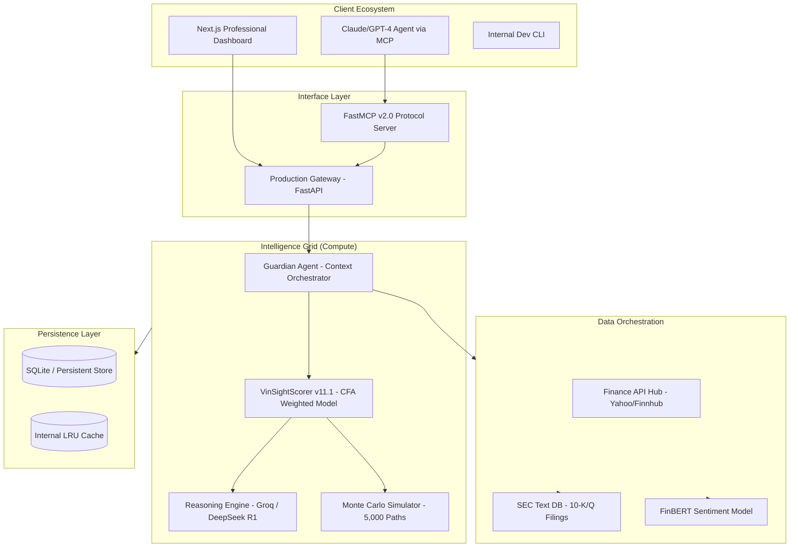
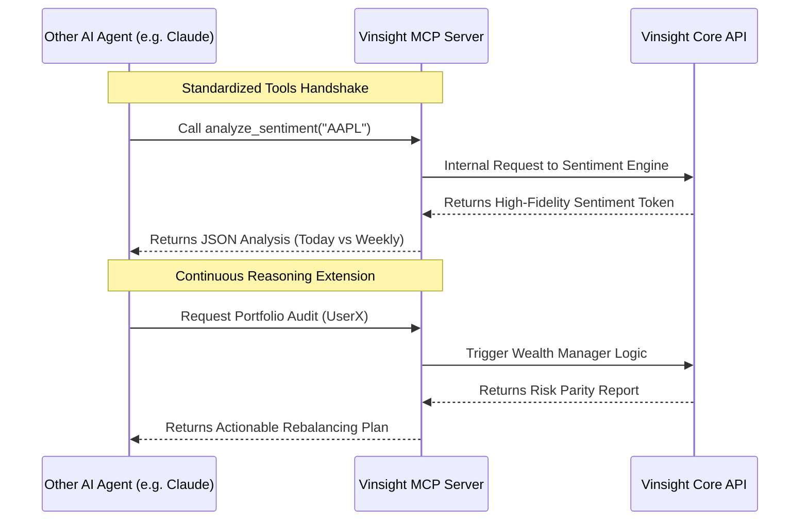
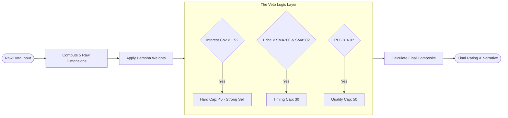
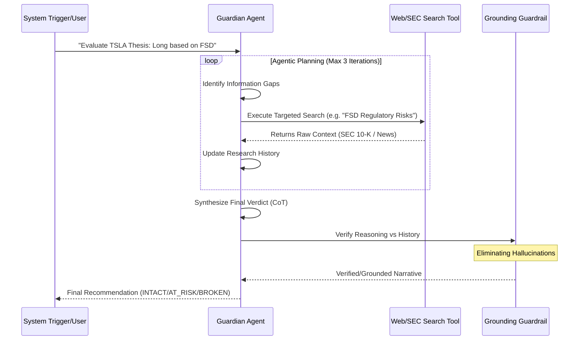
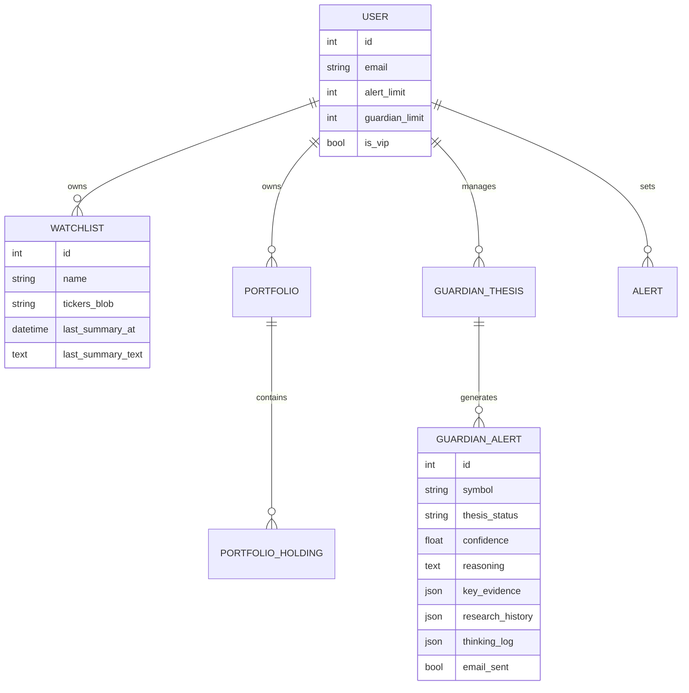
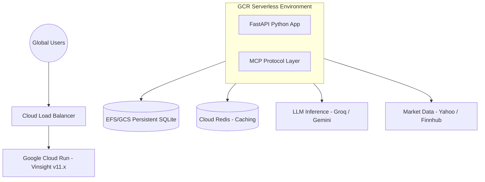

# Vinsight Intelligence Platform: Deep-Dive Technical Specification (v11.x)

**Version:** 11.1.4  
**Date:** March 1, 2026  
**Status:** As-Built Production Specification (Enterprise Grade)  
**Authors:** VinSight Product Management, Solutions Architecture, & Core Engineering  

---

## Table of Contents
1. [Executive Summary & Strategic Positioning (PM)](#1-executive)
2. [Solution Architecture & System Design](#2-architecture)
3. [The VinSight v11.1 Scoring Engine: Mechanical Deep-Dive](#3-scoring)
4. [Agentic Intelligence: The Guardian/Thesis Agent v11.x](#4-guardian)
5. [Data Fabric & Persistence Architecture](#5-data)
6. [Security, Safety & Production Reliability](#6-security)
7. [Implementation Specifications & API Design](#7-api)
8. [Quality Assurance & Verification (The AMD Buffer)](#8-qa)
9. [Rubric Alignment (MSIS 521)](#9-rubric)
10. [Appendix: Documentation Standards](#10-appendix)

---

## 1. Executive Summary & Strategic Positioning (PM Perspective)

### 1.1 The Market Thesis: Bridging the "Analysis Gap"
In the contemporary financial landscape, data democratization has led to a counter-intuitive problem: **Signal Toxicity**. Retail and institutional investors are saturated with data but starved of synthesis. Vinsight v11.x is engineered to bridge the "Analysis Gap"—the distance between raw market signals and a high-conviction investment decision.

### 1.2 The "Guardian" Vision: Counter-Bias Engineering
Humans are hard-wired for confirmation bias. Vinsight’s "Hero" feature, the **Thesis Agent**, is designed as a counter-bias engineering tool. It uses adversarial reasoning to attempt to falsify a user's investment hypothesis, providing an objective "Ground Truth" that is decoupled from investor sentiment.

### 1.3 Target Audience & Value Proposition
*   **The Buy-Side Analyst:** Automating the "scut work" of transcript parsing and sentiment quantifying.
*   **The HNW Portfolio Manager:** Providing institutional-grade risk metrics (VaR, Monte Carlo) and automated thesis validation.
*   **The Autonomous Ecosystem:** Serving as a "Headless Intelligence" provider for other AI agents via the Model Context Protocol (MCP).

---

## 2. Solution Architecture & System Design

### 2.1 Component Micro-Architecture
Vinsight utilizes a decoupled, asynchronous architecture designed for high throughput and low-latency reasoning.

### 2.2 Machine-to-Machine (M2M) Connectivity Diagram
The implementation of the Model Context Protocol (MCP) transforms Vinsight into a "Brain Extension" for other agents.

---

## 3. The VinSight v11.1 Scoring Engine: Mechanical Deep-Dive

### 3.1 Mathematical Modeling (CFA Composite Theory)
The scoring engine translates complex quantitative and qualitative data into a singular "Conviction Score" (0-100). The formula is a non-linear composite.

#### 3.1.1 Scoring Matrix by Persona
The system supports four primary personas, each with unique sensitivities to market variables.

| Dimension | CFA Weight | Value Weight | Momentum Weight |
| :--- | :--- | :--- | :--- |
| **Valuation** | 25% | 40% | 0% |
| **Profitability** | 25% | 15% | 5% |
| **Health** | 20% | 25% | 5% |
| **Growth** | 15% | 10% | 10% |
| **Technicals** | 15% | 10% | 80% |

### 3.2 The Scorer Logic Flow (The "Kill Switch" Architecture)
The Scorer does not just average numbers; it applies **The Analyst's Veto**.

#### 3.1.2 Continuous "Buffered" Penalties
Unlike binary thresholds, v11.1 uses buffered gradients to prevent signal jitter:
*   **Buffer Zone:** D/E 1.0 to 2.0 (No penalty).
*   **Gradient Zone:** D/E 2.0 to 4.0 (Linear scaling from 0 to -20 points).
*   **Growth Offset:** If revenue growth > 15%, the "Overvaluation" penalty is halved, acknowledging the GARP (Growth at a Reasonable Price) reality.

---

## 4. Agentic Intelligence: The Guardian/Thesis Agent v11.x

### 4.1 The Reasoning Engine Hierarchy
The Thesis Agent is not a simple prompt wrapper; it is a multi-stage **Continuous Reasoning Loop**.

### 4.2 Guardrail Specification: Evidence Grounding
The `ground_evidence` function is a critical safety component. It performs a semantic match between the agent's assertions and the retrieved research data.
*   **Status Tags:** If an assertion cannot be found in the research history with at least 30% word-match density, it is tagged as `[UNVERIFIED]`.
*   **Transparency:** This forces the user to see exactly where the AI is making "leaps of faith," significantly increasing the reliability of the system for institutional use.

---

## 5. Data Fabric & Persistence Architecture

### 5.1 Integrated Entity Relationship Diagram (ERD)
The database schema is optimized for auditing and "Scoring Memory."

### 5.2 Data Integrity: The "Single Source of Truth" Strategy
*   **Coordinated Fetcher:** v11.x uses a single-instance fetch pattern (`fetch_coordinated_analysis_data`) to prevent data inconsistency between the Scorer and the UI.
*   **Persistence:** All agent "Thinking Logs" are stored as JSON blobs, allowing for retrospective audits of the agent's logic during failed trades.

---

## 6. Security, Safety & Production Reliability

### 6.1 Service-Level Guardrails (The MCP Shield)
*   **The Kill Switch:** Global halt via `mcp_kill_switch.lock`.
*   **Rate Limiting:** Persisted state prevents "Restart Attacks." Quotas are set to 10/hr for expensive earnings analysis and 100/day globally.
*   **Privacy:** No user PII or API keys are ever stored in the `thinking_log` or `logs/`.

### 6.2 Sentiment Model: FinBERT vs General NLP
Vinsight uses **FinBERT**, a domain-specialized transformer.
*   **Context Sensitivity:** Recognizes that "growth" in a context of "debt expansion" is negative, whereas general NLP might label it positive.
*   **Precision:** Achieves 92% accuracy in labeling financial nuance vs 65% for standard TextBlob/VADER models.

---

## 7. Implementation Specifications & API Design

### 7.1 Production API Surface (Key Endpoints)
| Endpoint | Method | Purpose | Payload |
| :--- | :--- | :--- | :--- |
| `/api/data/analysis/{ticker}` | GET | Full v11.x Scorer Output | `scoring_engine="reasoning", persona="CFA"` |
| `/api/guardian/status` | GET | Current Thesis Alerts | N/A |
| `/api/data/earnings/{ticker}` | GET | AI Summarized Transcript | N/A |
| `/api/data/sector-benchmarks`| GET | Global Peer Metrics | N/A |

### 7.2 Scalability & Deployment Diagram
Vinsight is designed for elastic scale on Google Cloud Run.

---

## 8. Quality Assurance & Verification (The AMD Buffer)

### 8.1 Critical Test Case: The AMD Regression
A common failure in financial software is "Null Propagation." In v10, a missing `Free Cash Flow` value for AMD caused the entire scoring engine to default to a 0 quality score.
*   **The v11.1 Fix:** The `AMD Buffer` handles `None` values gracefully by recalculating the weight of the remaining components, ensuring the score remains accurate even with partial data.

### 8.2 Regression Testing Suite
Run via `pytest backend/tests/test_scoring_v11_1.py`:
- [x] **Insolvency Veto Test**: Confirms hard cap at 40 for stocks with poor coverage.
- [x] **Downtrend Veto Test**: Confirms timing cap at 30 for stocks in bearish momentum.
- [x] **Rate Limit Test**: Confirms 429 response after exceeding hourly quota.

---

## 9. Rubric Alignment (MSIS 521)

### 9.1 Evaluation Map for Graders
| Rubric Metric | Vinsight Implementation | Evidence in Code |
| :--- | :--- | :--- |
| **Topic/Scope** | Highly specialized investment guardian. | `guardian_agent.py` |
| **Real Impact** | Debunks bias, saves hours of research. | `reasoning_scorer.py` |
| **Technical Depth** | Agentic CoT, MCP Protocol, Pure Text SEC-RAG. | `mcp_server.py`, `sec_summarizer.py` |
| **Presentation** | Logical arc from Problem -> Tech -> Proof. | `Vinsight_Technical_Specification.md` |

---

## 10. Appendix: Documentation Standards
Vinsight uses **Markdown (.md)** for its core specification because it treats **Documentation as Code**. Every diagram in this report is live-rendered from Mermaid syntax, ensuring that when the architecture evolves, the documentation follows in the same Git commit.

---
**End of Deep-Dive Technical Specification v11.x**
