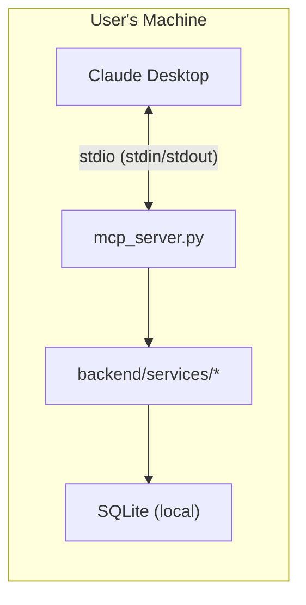
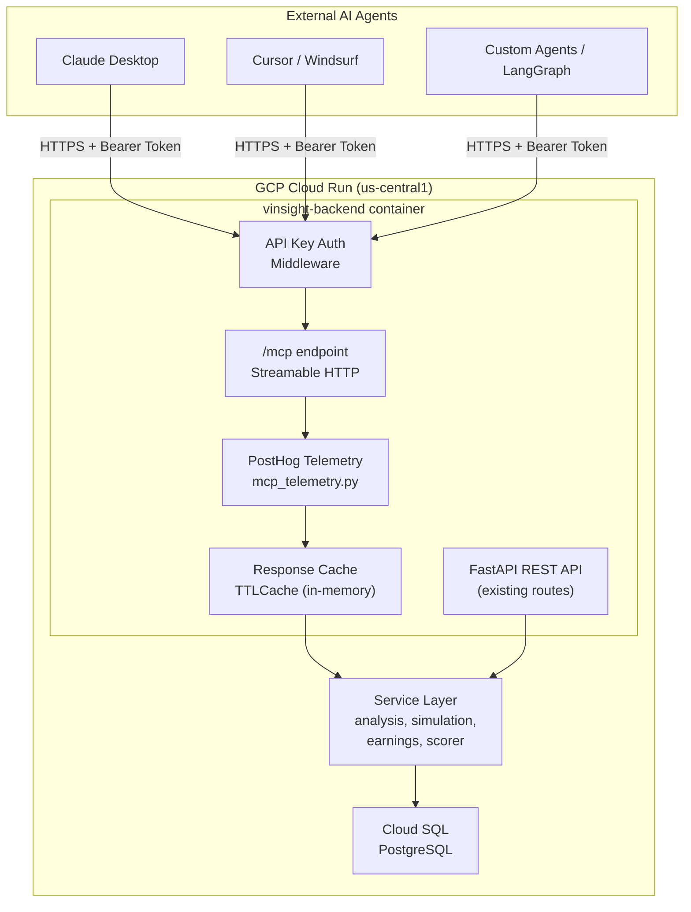

# VinSight MCP v2.0: Online Technical Design Document

**Version**: 2.0  
**Status**: ✅ **Phase 1 LIVE** (deployed 2026-05-09)  
**Date**: May 2026  
**Author**: AI Engineering Team  
**Scope**: Migration from local stdio MCP to production remote Streamable HTTP MCP  
**Security Audit**: Passed 2026-05-09 (see Decision 8 in `MCP_DECISION_TRADEOFFS.md`)

---

## 1. Executive Summary

VinSight MCP v1.0 is a local-only stdio server that exposes financial analysis tools to AI agents. This document specifies the v2.0 architecture: a production-grade, remotely-accessible MCP endpoint embedded in the existing FastAPI backend on Google Cloud Run.

**Key Decision**: Embed MCP as a sub-application within the existing FastAPI service rather than deploying a standalone microservice. This eliminates infrastructure overhead while preserving a clear upgrade path.

---

## 2. Architecture

### 2.1 Current State (v1.0 — Local Only)



**Limitations**:
- Only works on the machine running the Python process
- No external agent access (Claude Desktop only)
- No telemetry, no caching, manual kill switch
- Separate process from the FastAPI backend — duplicates service code

### 2.2 Target State (v2.0 — Remote)



### 2.3 Key Architectural Properties

| Property | v1.0 (Current) | v2.0 (Target) |
|:---------|:---------------|:---------------|
| Transport | stdio | Streamable HTTP |
| Deployment | Local process | Cloud Run (shared container) |
| Auth | None (local trust) | API Key (Bearer token) |
| Telemetry | File logs only | PostHog events |
| Caching | None | TTLCache (per-tool TTL) |
| Rate Limiting | File-based JSON | In-memory TTLCache + PostHog tracking |
| Database | SQLite | Cloud SQL PostgreSQL |
| Scale | Single user | Auto-scaling (0→N instances) |

---

## 3. Transport Protocol Decision

### 3.1 Options Evaluated

| Transport | Description | Pros | Cons |
|:----------|:------------|:-----|:-----|
| **stdio** | stdin/stdout IPC | Zero latency, maximum security | Local only — unusable for remote |
| **SSE (HTTP+SSE)** | Dual-channel: HTTP POST + SSE stream | Widely supported by current clients | Deprecated in MCP 2025 spec; dual-channel complexity; proxy/firewall issues |
| **Streamable HTTP** | Single `/mcp` endpoint, optional SSE upgrade | New MCP standard; single endpoint; infrastructure-friendly; stateless-capable | Newer — some older clients may not support |

### 3.2 Decision: Streamable HTTP

**Chosen**: Streamable HTTP (with SSE backward compatibility)

**Rationale**:
1. **MCP 2025 spec mandates it** — SSE is officially deprecated for new implementations
2. **Single endpoint** (`/mcp`) — simpler routing, no dual-channel management
3. **Infrastructure-friendly** — works with standard load balancers, proxies, CDNs
4. **Stateless design** — better fit for Cloud Run's auto-scaling (no sticky sessions needed)
5. **Backward compatible** — can serve SSE clients via upgrade mechanism

**Risk**: Some older MCP clients (pre-2025) may only support SSE. Mitigated by the backward compatibility layer built into the `mcp[http]` library.

---

## 4. Embedding vs. Standalone Service Decision

### 4.1 Options Evaluated

| Option | Description | Cost | Effort | Scale Path |
|:-------|:------------|:-----|:-------|:-----------|
| **A: Embed in FastAPI** | Mount MCP as ASGI sub-app at `/mcp` | $0 incremental | ~3h | Extract to microservice later |
| **B: Standalone Cloud Run** | Separate container + service | $0–5/mo | ~6h | Already isolated |
| **C: Cloudflare Workers** | Edge deployment | $0 | ~3 days | Global scale, but JS-only |
| **D: Fly.io** | Container PaaS | $2–5/mo | ~4h | Multi-region |

### 4.2 Decision: Embed in FastAPI (Option A)

**Rationale**:

1. **Zero infrastructure cost** — uses existing Cloud Run backend, no new services
2. **Zero code duplication** — MCP tools call the same service functions as REST routes
3. **Shared infrastructure** — auth, logging, DB connection, rate limiting all reused
4. **Clean upgrade path** — extracting to a standalone service later is a mechanical refactor, not an architectural change
5. **Single deployment** — `deploy.sh` unchanged, one container, one CI pipeline

**Tradeoffs accepted**:
- MCP traffic shares CPU/memory with web API traffic (acceptable at current scale)
- Cannot scale MCP independently (mitigated: Cloud Run auto-scales the whole container)
- MCP cold starts are tied to backend cold starts (mitigated: Phase 2 adds `min-instances: 1`)

**When to revisit**: If MCP traffic exceeds 30% of total backend CPU (tracked via PostHog + Cloud Run metrics), extract to standalone service (Phase 3).

---

## 5. Authentication Design

### 5.1 Options Evaluated

| Method | Security | Complexity | Client Support |
|:-------|:---------|:-----------|:---------------|
| **No auth** | ❌ Public | None | Universal |
| **API Key (Bearer)** | ✅ Good | Low | Universal |
| **OAuth 2.1** | ✅✅ Enterprise | High | Limited (newer clients) |
| **mTLS** | ✅✅✅ Maximum | Very High | Poor (client cert management) |

### 5.2 Decision: API Key (Phase 1) → OAuth 2.1 (Phase 3)

**Phase 1**: Simple `Authorization: Bearer <MCP_API_KEY>` header check

**Rationale**:
1. Every MCP client supports custom headers
2. One secret to manage (stored in GCP Secret Manager)
3. Can issue multiple keys for different consumers (tracked via `api_key_id` in PostHog)
4. No OAuth server infrastructure needed

**Phase 3 upgrade**: When unique API keys exceed 20 (tracked by telemetry), migrate to OAuth 2.1 with Google Cloud Identity Platform. The API key mechanism becomes a fallback for legacy clients.

### 5.3 Key Management

```
MCP_API_KEY format: vinsight_mcp_<random_hex_32>
Example:           vinsight_mcp_a1b2c3d4e5f6...

Storage:           GCP Secret Manager (MCP_API_KEY:latest)
Rotation:          Manual, via `gcloud secrets versions add`
Revocation:        Update secret + redeploy (or add key blacklist in Phase 2)
```

---

## 6. Rate Limiting Design

### 6.1 v1.0 Limitations
- File-based (`logs/mcp_limits.json`) — doesn't work across Cloud Run instances
- Reset on server restart if file is lost
- No per-consumer tracking

### 6.2 v2.0 Design: In-Memory TTLCache

| Layer | Scope | Limit | Implementation |
|:------|:------|:------|:---------------|
| **Global daily** | All tools, all consumers | 500 calls/day | `cachetools.TTLCache` with 24h TTL |
| **Per-tool hourly** | Individual tool | Varies (see below) | `cachetools.TTLCache` with 1h TTL |
| **Per-key daily** | Individual API key | 100 calls/day | `cachetools.TTLCache` keyed by `api_key_id` |

**Per-tool hourly limits**:

| Tool | Hourly Limit | Rationale |
|:-----|:-------------|:----------|
| `analyze_sentiment` | 60/hr | Free (Groq) — generous |
| `run_monte_carlo` | 100/hr | Zero LLM cost — very generous |
| `search_financial_news` | 100/hr | Zero LLM cost |
| `get_stock_score` | 30/hr | Moderate LLM cost |
| `analyze_earnings` | 10/hr | High LLM cost (long context) |

**Tradeoff**: In-memory counters reset on container restart. Accepted because:
- Cloud Run instances are long-lived (minutes to hours)
- PostHog tracks actual usage for billing/auditing regardless
- Over-counting (allowing extra calls after restart) is preferable to the complexity of Redis

**When to add Redis**: If we need strict cross-instance rate limiting (Phase 3, >1000 users).

---

## 7. Caching Strategy

### 7.1 Design: Per-Tool TTL Cache

| Tool | TTL | Rationale |
|:-----|:----|:----------|
| `analyze_sentiment` | 3 hours | Already cached in `services/cache.py` — reuse |
| `run_monte_carlo` | 30 min | Stochastic output, but bounded — cache is acceptable |
| `search_financial_news` | 1 hour | News doesn't change per-minute |
| `get_stock_score` | 1 hour | Fundamentals refresh daily |
| `analyze_earnings` | 6 hours | Transcripts are static within a quarter |

### 7.2 Cache Key Structure
```
{tool_name}:{ticker}:{normalized_params_hash}
```
Example: `analyze_sentiment:AAPL:d41d8cd9`

### 7.3 Cache Hit Telemetry
Every cache hit fires a PostHog `mcp_cache_hit` event with `cache_age_seconds`, enabling:
- Cache hit rate tracking
- TTL tuning based on actual reuse patterns
- Cost savings quantification

---

## 8. Telemetry Architecture

### 8.1 Events Schema

All events use `distinct_id = "mcp_server"` to separate MCP analytics from user analytics in PostHog.

```json
// mcp_tool_call (success)
{
  "event": "mcp_tool_call",
  "distinct_id": "mcp_server",
  "properties": {
    "tool": "analyze_sentiment",
    "ticker": "AAPL",
    "duration_ms": 1234.5,
    "cached": false,
    "api_key_id": "key_abc123",
    "success": true
  }
}

// mcp_tool_error (failure)
{
  "event": "mcp_tool_error",
  "distinct_id": "mcp_server",
  "properties": {
    "tool": "analyze_earnings",
    "ticker": "NVDA",
    "duration_ms": 5432.1,
    "error_code": "TimeoutError",
    "error_message": "DeepSeek R1 call exceeded 180s"
  }
}
```

### 8.2 Phase Transition Metrics

| Metric | Phase 1→2 Threshold | Phase 2→3 Threshold |
|:-------|:--------------------|:--------------------|
| Daily MCP calls (7d avg) | > 50 | > 500 |
| Unique API keys (7d) | > 5 | > 20 |
| p95 latency | > 5 seconds | N/A (solved by min-instances) |
| Error rate | > 10% | > 5% |
| MCP % of backend CPU | N/A | > 30% |
| Daily LLM cost (MCP) | N/A | > $2/day |

---

## 9. Error Handling

### 9.1 Error Response Schema (Unchanged from v1.0)
```json
{
  "error": "Descriptive message for the AI agent",
  "code": "RATE_LIMIT_EXCEEDED",
  "status": "failed"
}
```

### 9.2 Error Codes

| Code | HTTP Equiv | When |
|:-----|:-----------|:-----|
| `UNAUTHORIZED` | 401 | Missing or invalid API key |
| `RATE_LIMIT_EXCEEDED` | 429 | Daily, hourly, or per-key limit hit |
| `NO_DATA` | 404 | Ticker not found or no news available |
| `DATA_FETCH_FAILED` | 502 | Upstream API (Finnhub, Yahoo) failed |
| `LLM_TIMEOUT` | 504 | DeepSeek/Groq/Gemini call exceeded timeout |
| `INTERNAL_ERROR` | 500 | Unexpected server error |

---

## 10. Deployment

### 10.1 Changes Required

| File | Change |
|:-----|:-------|
| `backend/requirements.txt` | Add `mcp>=1.0.0` |
| `backend/mcp_tools.py` | **NEW** — Tool definitions + MCP app |
| `backend/mcp_telemetry.py` | **NEW** — PostHog event wrappers |
| `backend/main.py` | Mount MCP at `/mcp` (3 lines) |
| `backend/.env` | Add `MCP_API_KEY` |
| `deploy.sh` | Add `MCP_API_KEY` to `--set-secrets` |
| `backend/Dockerfile` | No changes (same container) |

### 10.2 Rollback Plan
If the MCP endpoint causes issues:
1. **Soft disable**: Set `MCP_ENABLED=false` env var → endpoint returns 503
2. **Hard disable**: Remove `app.mount("/mcp", ...)` from `main.py` → redeploy
3. **Rollback**: `gcloud run services update-traffic --to-revisions=PREVIOUS_REVISION=100`

---

## 11. Security Considerations

> **Full audit**: See `MCP_DECISION_TRADEOFFS.md` → Decision 8 for complete audit results.

| Threat | Mitigation | Status |
|:-------|:-----------|:-------|
| **Timing attack on API key** | `hmac.compare_digest()` constant-time comparison | ✅ Fixed |
| **Denial of Wallet** (agent loops draining LLM credits) | Per-key daily limit (100 calls), global daily limit (500 calls) | ✅ Live |
| **Data exfiltration** (agent reads all user portfolios) | MCP tools don't expose user data without authentication (portfolio tool disabled in Phase 1) | ✅ Live |
| **Prompt injection** (malicious ticker names) | Input sanitization: `ticker.strip().upper()[:10]`, alphanum whitelist | ✅ Live |
| **API key leakage** | Keys stored in GCP Secret Manager, `.env` in `.gitignore` | ✅ Verified |
| **Error info disclosure** | Error messages truncated to 200 chars in telemetry | ✅ Live |
| **Bot probing** | `mcp_auth_failure` telemetry + PostHog alert on >50/hour | ✅ Live |
| **DB session leak** | `try/finally db.close()` in earnings tool | ✅ Verified |

---

## 12. Cost Projections

### Per-Phase

| Phase | Infra Cost | LLM Cost (est.) | Total |
|:------|:-----------|:-----------------|:------|
| Phase 1 | $0 incremental | $0–2/day | **$0–60/mo** |
| Phase 2 | +$7/mo (min-instance) | $0–2/day (with `:free` tiers) | **$7–67/mo** |
| Phase 3 | +$15/mo (standalone service) | $2–10/day | **$22–315/mo** |

### Per-Tool LLM Cost

| Tool | LLM Provider | Cost/Call | With Cache (est.) |
|:-----|:-------------|:----------|:------------------|
| `analyze_sentiment` | Groq (free tier) | $0.00 | $0.00 |
| `run_monte_carlo` | None (NumPy) | $0.00 | $0.00 |
| `search_financial_news` | None | $0.00 | $0.00 |
| `get_stock_score` | Groq → DeepSeek | $0.01–0.03 | $0.003–0.01 |
| `analyze_earnings` | DeepSeek R1 | $0.03–0.08 | $0.005–0.013 |

---

## 13. Appendix: Files Deprecated by v2.0

| File | Status | Reason |
|:-----|:-------|:-------|
| `backend/mcp_server.py` | **Deprecated** | Replaced by `mcp_tools.py` (embedded in FastAPI) |
| `backend/gemini_mcp_client.py` | **Deprecated** | No longer needed — Claude/Cursor are the client |
| `backend/manage_kill_switch.py` | **Deprecated** | Replaced by env-var `MCP_ENABLED` + rate limiting |
| `logs/mcp_limits.json` | **Deprecated** | Replaced by in-memory TTLCache + PostHog tracking |
| `mcp_kill_switch.lock` | **Deprecated** | Replaced by `MCP_ENABLED` env var |
