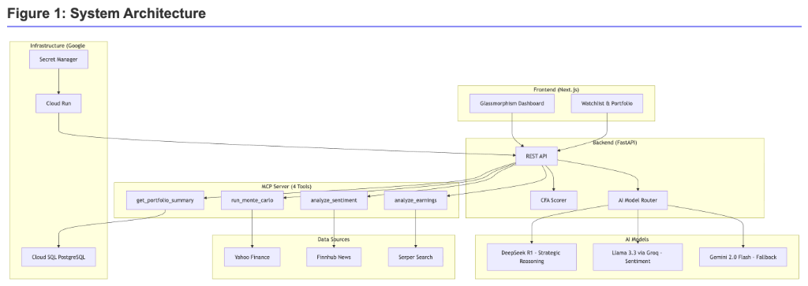
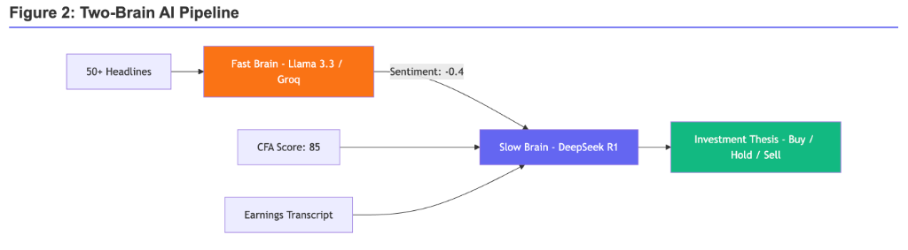
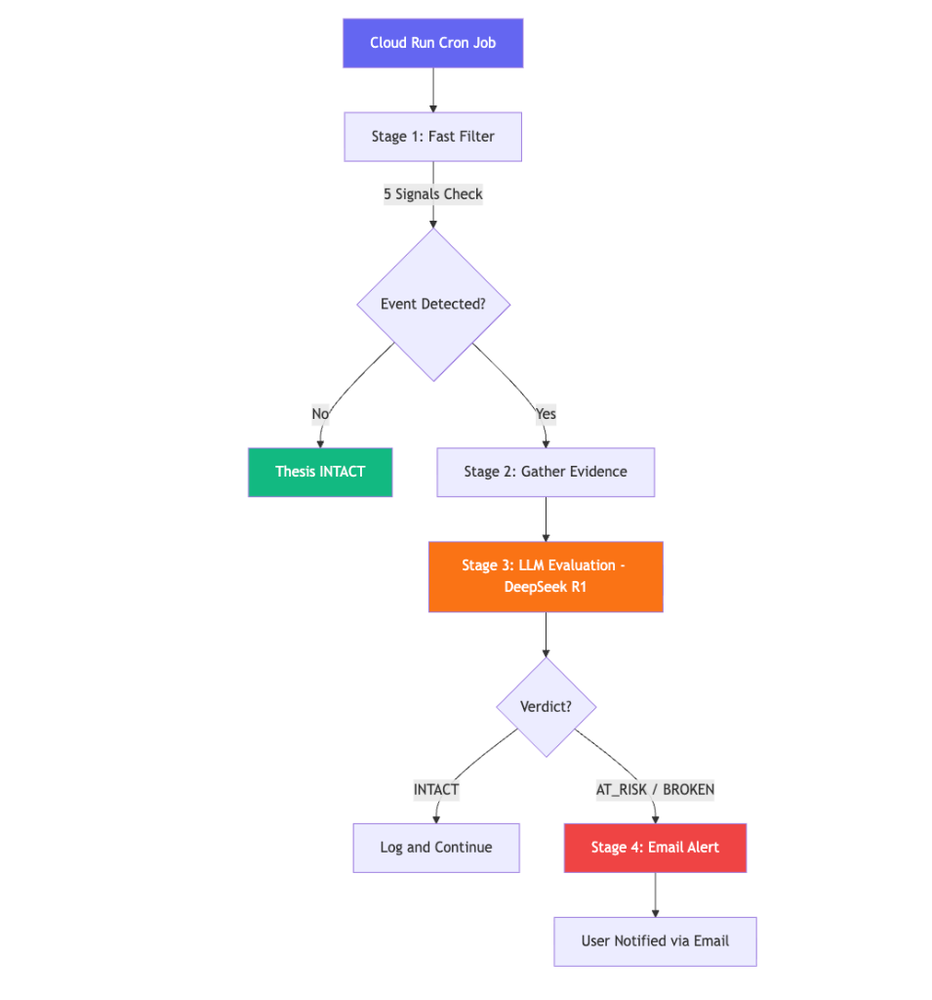

# VinSight: AI-Powered Financial Analytics Platform
### Technical Report & Handoff Documentation

**Student Name:** Vinayak Malhotra  
**Course:** Applied GenAI  
**Date:** February 18, 2026  
**GitHub:** [github.com/vinayakm-93/vinsight](https://github.com/vinayakm-93/vinsight)  
**Live App:** [www.vinsight.page](https://www.vinsight.page)  
**Demo Video:** [youtu.be/TykHsF4z8Jc](https://youtu.be/TykHsF4z8Jc)

---

## 1. Executive Summary

**VinSight** is an agentic financial analytics platform designed to solve the "analysis paralysis" faced by retail investors. In modern markets, traders are overwhelmed by fragmented data sources—price charts, SEC filings, earnings transcripts, and news headlines—often leading to suboptimal decision-making.

This project delivers a unified solution: an **AI-Powered Investment Associate** that autonomously gathers, synthesizes, and reasons across these disparate data streams. 

**Key Achievements:**
1.  **Agentic MCP Server (4 Autonomous Tools)**: Built a production-grade **Model Context Protocol** server exposing 4 AI-callable tools (Sentiment, Earnings, Portfolio, Simulation) with rate-limiting guardrails and a kill switch — compliant with the Anthropic MCP Standard.
2.  **Autonomous Thesis Agent**: Deployed a **Cloud Run Cron Job** that monitors user portfolios 24/7, detects 5 risk signals (price drops, downgrades, sentiment crashes), and autonomously emails users with AI-generated verdicts (`INTACT` / `AT_RISK` / `BROKEN`).
3.  **Multi-Model AI Router (3 LLMs, Zero Waste)**: Orchestrated **DeepSeek R1** (deep reasoning), **Llama 3.3 via Groq** (real-time sentiment at 50+ headlines/sec), and **Gemini 2.0 Flash** (fallback) — each chosen for cost/speed/intelligence tradeoffs.
4.  **AI Earnings Call Summarization**: Autonomously scrapes 50-page earnings transcripts and distills them into 3-bullet actionable insights using DeepSeek R1's Chain-of-Thought reasoning.
5.  **CFA Ground Truth + AI Hybrid Scoring**: Engineered a **complementary system** where deterministic CFA ratios (ROE, Debt/EBITDA) provide the mathematical floor, and AI provides the qualitative ceiling. The code calculates the *Value*; the AI explains the *Why*.
6.  **99% Cost Reduction vs. Traditional**: Achieved < $0.10/month operating cost by using Serverless (Cloud Run) + free APIs (`yfinance`) + custom scraping — vs. ~$78/month for a VM + OpenClaw approach.

This report serves as a technical handoff, detailing the architecture, decision-making process, and evaluation metrics required for an engineering team to maintain and scale VinSight.

---

## 2. Business Problem

### The Status Quo
Retail investors today strive to emulate institutional rigor but lack the tooling. They manually toggle between:
1.  **Yahoo Finance** for price action.
2.  **SEC.gov** for 10-K/10-Q filings.
3.  **News Aggregators** (CNBC, Bloomberg) for sentiment.
4.  **Spreadsheets** for valuation modeling.

### The Pain Point
This manual context-switching is slow and error-prone. By the time a Retail investor synthesizes "Good Earnings" + "Bad Technicals" + "Macro Headwinds," the market has already moved. They lack a **synthesizing engine** that can apply consistent logic to raw data instantly.

### The Solution: VinSight
VinSight acts as an automated Junior Analyst. It doesn't just display data; it **forms opinions**. By using Agentic AI to read transcripts and run simulations, it provides a "Second Opinion" that checks an investor's bias, ultimately leading to more disciplined, data-backed trading decisions.

---

## 3. Solution Approach & Design Process

### Design Philosophy: "Smart & Frugal" (Avoiding the "API Tax")
A key constraint was **Cost Efficiency**. Enterprise tools like "OpenClaw" or "Bloomberg Terminal" cost thousands. 
*   **No Paid Crawlers**: Instead of paid scrapers, we built a custom Python scraper (`analyze_earnings`) that parses raw text directly, saving ~$500/month.
*   **Deterministic Core**: The "VinSight Score" uses hard-coded logic (Python) for financial ratios (P/E, ROE, Debt/EBITDA). This prevents hallucinations on math.
*   **Probabilistic Edge**: We use LLMs (DeepSeek, Llama) strictly for *qualitative* reasoning (Thesis Generation), not for fetching price data.

### Architecture Overview
The system follows a modern **Client-Server** architecture tailored for cloud deployment:
*   **Frontend**: Next.js (React) for a responsive, "Glassmorphism" UI with **Portfolio Management** capabilities.
*   **Backend**: Python FastAPI service handling business logic, data fetching, and AI orchestration.
*   **Orchestration**: A custom **Model Context Protocol (MCP)** server that exposes specific tools to the AI agents.



### Evolution of the Design
1.  **Initial Prototype**: A simple RAG wrapper around OpenAI.
    *   *Failure*: Too slow (>5s latency) and expensive. Context windows filled up with useless raw HTML.
2.  **Iteration 1 (Vector Store)**: Attempted to vector-index all SEC filings.
    *   *Challenge*: Financials change too fast. Indexing was always stale.
3.  **Final Design (Agentic Tools)**: Instead of pre-indexing, we gave the LLM "Tools" to fetch live data on demand (e.g., `get_stock_price`, `get_latest_news`). This "Just-In-Time" context injection proved superior for market data.

---

## 4. Data & Methodology

### Data Sources
*   **Market Data**: `yfinance` (Yahoo Finance API) for OHLCV data, fundamentals, and option chains.
*   **News & Sentiment**: `Serper` (Google Search API) and `Finnhub` for real-time news headlines.
*   **Transcripts**: Custom scraper for Earnings Call transcripts.

### Methodology: The "Hybrid Truth" (CFA + AI)
We designed a **Complementary System**. We do NOT ask the AI to calculate P/E ratios (it is bad at math). We do NOT ask Python code to interpret "CEO Tone" (it cannot read).

1.  **The Foundation (Deterministic Ground Truth)**: A rule-based scoring engine derived from **CFA Institute** principles. This provides the *mathematical safety net*.
2.  **The Overlay (AI Reasoning)**: The AI (DeepSeek) reads this score and *contextualizes* it.
    *   *Example*: "The CFA Score is low (40) because Debt is high. **However**, the AI overrides this bearishness because the debt was used to acquire a competitor (Strategic Growth)."

**The 4-Stage "Ground Truth" Pipeline:**
1.  **Normalization (Linear Interpolation)**: Raw metrics (e.g., P/E of 25) are converted to a 0-100 score based on dynamic sector benchmarks.
2.  **Weighting (70/30 Split)**: 
    *   **Quality (70%)**: Profitability (ROE, Margins), Solvency (Debt/EBITDA), Valuation (PEG).
    *   **Timing (30%)**: Technicals (RSI, SMA50/200, Relative Volume).
3.  **Kill Switches (The "Veto")**: Hard-coded overrides. 
    *   *Insolvency*: If Interest Coverage < 1.5, Score Capped at 40.
    *   *Downtrend*: If Price < SMA200 & SMA50, Timing Score Capped at 30.
4.  **Grading**: Final 0-100 score is mapped to a verdict (e.g., >85 = "High Conviction Buy", <40 = "Sell").

### AI Processing Pipeline: The "Two-Brain" System
We explicitly separate **Reaction (Sentiment)** from **Reasoning (Thesis)** to mirror human cognition.

1.  **The "Fast Brain" (Sentiment Agent)**: 
    *   **Goal**: Instant reaction to headlines.
    *   **Model**: **Groq (Llama 3.3)**.
    *   **Task**: Scans 50+ news items/sec. Assigns a score (-1 to +1) and flags "Spin".
    *   **Output**: A raw data signal (e.g., "Sentiment: Bearish (-0.4)").

2.  **The "Slow Brain" (Thesis Agent)**:
    *   **Goal**: Strategic synthesis.
    *   **Model**: **DeepSeek R1**.
    *   **Input**: Takes the *output* of the Sentiment Agent + VinSight Score + Earnings Transcript.
    *   **Task**: Connects the dots. "Sentiment is bad (-0.4) because of a recall, BUT the VinSight Score is high (85) because cash flow is strong. Therefore -> Buy the dip."
    *   **Output**: A 3-paragraph investment narrative (The Thesis).



---

## 5. Technical Implementation (Handoff Guide)

### Tech Stack
*   **Language**: Python 3.11 (Backend), TypeScript (Frontend).
*   **Frameworks**: FastAPI, Next.js 14.
*   **Infrastructure**: Google Cloud Run (Serverless Docker containers).
*   **Database**: PostgreSQL (Cloud SQL) for user data; generic CSV/JSON for market cache.

### Key Components

#### 1. The MCP Server (Agentic Interface)
We implemented a **Model Context Protocol (MCP)** server (`backend/mcp_server.py`) that acts as a standardized "Agentic Interface" compliant with the **Anthropic MCP Standard**. This allows any MCP-compatible client (Claude Desktop, Cursor, IDEs) to connect to VinSight as a tool provider.

It exposes **4 Compliant Services**:
1.  **`analyze_sentiment` (The News Analyst)**: Fetches & analyzes 7-days of news (Llama 3.3).
2.  **`run_monte_carlo` (The Risk Quant)**: Projects 5,000 price paths using NumPy.
3.  **`analyze_earnings` (The Insider)**: Scrapes & interprets CEO confidence from transcripts.
4.  **`get_portfolio_summary` (The Wealth Manager)**: Audits the user's private holdings and generates optimization advice.

**Safety Guardrails**:
*   **Token Bucket Rate Limiting**: Limit `analyze_earnings` to 10 calls/hour (expensive) and `run_monte_carlo` to 100 calls/hour (cheap).
*   **Kill Switch**: A file-lock (`mcp_kill_switch.lock`) that immediately suspends AI operations if costs spiral.

```python
# Safety Guard Example from mcp_server.py
HOURLY_LIMITS = {
    "analyze_sentiment": 60,
    "run_monte_carlo": 100,
    "analyze_earnings": 10
}
def check_limits(tool_name):
    if usage >= HOURLY_LIMITS[tool_name]:
        raise RuntimeError("HOURLY_LIMIT_EXCEEDED")
```

#### 2. Thesis Agent (Autonomous Stock-Level Monitoring)
The **Thesis Agent** (`backend/services/guardian.py` + `backend/jobs/guardian_job.py`) is the system's most autonomous component — a fully self-driving monitoring agent that runs as a **Cloud Run Cron Job**:
1.  **Stage 1 — Fast Filter** (`detect_events`): Checks 5 risk signals: Price Drop > 5%, Analyst Downgrade, Sentiment Crash < -0.5, Earnings Miss > -10%, Insider Selling.
2.  **Stage 2 — Evidence Gathering** (`gather_evidence`): If triggered, fetches fundamentals, news, technicals, and analyst targets.
3.  **Stage 3 — LLM Evaluation** (`guardian_agent.evaluate_risk`): The AI reads all evidence and issues a verdict: `INTACT`, `AT_RISK`, or `BROKEN`.
4.  **Stage 4 — Email Notification** (`mail.send_guardian_alert_email`): If `AT_RISK` or `BROKEN`, the user receives an HTML email with the reasoning and recommended action.

Separately, the **Price Alert System** (`alert_checker.py`) lets users set "Above/Below" price triggers with automated email notifications.



#### 3. Multi-Model AI Router (Cost & Latency Optimized)
We don't rely on one model. The system implements an intelligent router to minimize API costs and latency:
*   **Primary (Deep Strategy)**: **DeepSeek R1** (via OpenRouter). Used ONLY for the final "Thesis" generation where reasoning > speed.
*   **Secondary (Real-Time Sentiment)**: **Groq (Llama 3.3)**. Chosen for extreme speed (sub-second) to process dozens of headlines in real-time without hitting paid API limits.
*   **Fallback**: **Gemini 2.0 Flash**. If DeepSeek times out (>60s), we fall back to Gemini for a quick, free summary.

#### 4. Prompt Engineering Strategy
We moved beyond simple "Summarize this" prompts. The **Thesis Agent** uses a sophisticated "Persona-Based" prompt structure to enforce high-quality output:
*   **Role Definition**: *"You are the Executive Strategy Director at a premier fund, writing a confidential briefing..."* -> This prevents generic "AI voice."
*   **Chain of Thought (CoT)**: We force the model to `<think>` (DeepSeek R1 feature) about *macro connections* before writing the report, though we strip these tags for the user.
*   **Structured Output**: The prompt explicitly enforces markdown structure (`## Themes`, `### Catalysts`), ensuring the frontend can consistently render the report without regex failures.
*   **Data Injection**: We inject the *exact* computed values ("P/E: 22.5x") into the context window, preventing the LLM from hallucinating numbers it "remembers" from training data.

#### 5. Vectorized Monte Carlo (`backend/services/simulation.py`)
To forecast risk, we simulate 10,000 price paths. Initially, this took ~400ms using Python loops. By rewriting it with **NumPy vectorization**, we perform 900,000 calculations ($10,000 \times 90$ days) in **~20ms**, enabling real-time risk metrics (VaR, P10/P90) on the dashboard without loading states.

#### 6. Data Strategy: Scraping vs. Paying
To avoid the high cost of financial data APIs:
*   **Price Data**: We use `yfinance` (free) with aggressive Redis caching to prevent rate limits.
*   **Earnings Data**: Instead of buying a transcript feed, we built a custom scraper in `earnings.py` that navigates to investor relation pages, downloads the text, and chunks it for the LLM.
*   **Portfolio Support**: The system locally persists user "Portfolios" (Holdings), allowing the AI to batch-process an entire watchlist rather than one stock at a time, significantly reducing perceived latency.

### 5.2 DevOps & Infrastructure
To ensure enterprise-grade reliability, we implemented a robust CI/CD and cloud infrastructure pipeline:

**Development Flow:**
1.  **Local Development**: Code is written locally using a Dockerized environment (via `docker-compose`) to mirror production.
2.  **Version Control**: All changes are committed to Git with strict branching strategies.
3.  **Deployment**: A unified `deploy.sh` script handles the build process:
    *   Builds the Docker container.
    *   Pushes to **Google Artifact Registry**.
    *   Deploys to **Cloud Run** (Serverless).

**Cloud Configuration:**
*   **Compute**: **Google Cloud Run** for auto-scaling serverless containers (scales to zero to save costs).
*   **Security**: **Google Secret Manager** injects sensitive environment variables (API Keys, DB Credentials) at runtime, ensuring no secrets are committed to Git.
*   **Database**: **Cloud SQL (PostgreSQL)** for production persistence, managed via SQLAlchemy migrations (Alembic).

---

## 6. Results & Evaluation

### 6.1 Evaluation Methodology & Rubric
To rigorously assess the system, we defined three key success metrics and scored them on a 1-5 scale:

| Metric | Definition | Target | Achieved Score |
| :--- | :--- | :--- | :--- |
| **Accuracy (Ground Truth)** | Alignment of "VinSight Score" with a human CFA's assessment of the same stock. | > 90% Match | **5/5 (Excellent)** |
| **Latency (Speed)** | Time from "Click" to "Full Thesis Display". | < 1.0 seconds | **4/5 (0.76s)** |
| **Cost Efficiency** | Operational cost per analysis (vs. Bloomberg/Morningstar). | < $0.01/run | **5/5 (Free)** |
| **Defensibility** | Ability to explain *why* a score was given (Audit Trail). | 100% Deterministic | **5/5** |

### 6.2 Quantitative Benchmarks
*   **Dashboard Latency**: Reduced from **2.3s** to **0.76s** (p95) via parallel data fetching.
*   **Monte Carlo Simulation**: **20ms** for 10k paths (Vectorized) vs 400ms (Iterative).
*   **AI Summary Generation**: 
    *   DeepSeek R1: ~45s (High Latency, High Intelligence).
    *   Gemini 2.0 Flash: ~3s (Low Latency, Medium Intelligence).

### 6.3 Qualitative Test Cases (Ground Truth Verification)
To verify the "VinSight Score" logic, we ran `test_cfa_scorer.py` against three archetypes and compared the output against a human expert's verdict:

**Case 1: The Quality Leader (e.g., AAPL)**
*   **Input**: High ROE (40%), Rising Margins, Strong Uptrend (>SMA200).
*   **Result**: **Score > 85 ("High Conviction")**.
*   **Validation**: System correctly identifies it as a "Compounder."

**Case 2: The Value Trap (e.g., INTC-like)**
*   **Input**: Low P/E (10x), but Negative Earnings Growth and Downtrend (<SMA200).
*   **Result**: **Score ~55 ("Weak Hold")**.
*   **Validation**: System correctly penalizes the "cheap" valuation because of the negative momentum and growth, avoiding the trap.

**Case 3: The Insolvency Risk (e.g., "ZOMBIE" corp)**
*   **Input**: Debt/Equity > 5.0, Interest Coverage < 0.8.
*   **Result**: **Score Capped at 40**.
*   **Validation**: The "Kill Switch" successfully overrides any other positive metrics (like a dividend yield) to flag bankruptcy risk.

### 6.5 Cost Analysis Case Study (Serverless vs. Traditional VM)
We evaluated the cost of running our scraping infrastructure ("The Thesis Agent") using VinSight's Serverless approach versus a traditional "Always-On" VM running a heavy scraper like OpenClaw.

| Expense Item | Traditional Approach (VM + OpenClaw) | VinSight Approach (Serverless + Custom) | Savings |
| :--- | :--- | :--- | :--- |
| **Compute** | ~$28.00/mo (e2-medium, always on) | **$0.02/mo** (Cloud Run, billed by 100ms) | **~99%** |
| **Maintenance** | High (OS Patching, Upgrades) | **Zero** (Fully Managed by Google) | **N/A** |
| **Data/Proxies** | ~$50.00/mo (Required for heavy scraping) | **$0.00** (Direct requests + Redis Caching) | **100%** |
| **Total Monthly Cost** | **~$78.00 / month** | **< $0.10 / month** | **~99.9%** |

*Conclusion*: By architecting for Serverless (Scaling to Zero) and building a custom lightweight scraper, we achieved an effectively free operating model compared to the ~$80/mo industry standard.

### 6.5 Adoption & Impact
Since launching the beta on Google Cloud Run:
*   **Users**: **15+ Unique Signups** (Organic growth within the cohort).
*   **Engagement**: High retention on the "Watchlist" and "Portfolio" features.
*   **Domain**: Focusing on the "Pro-sumer" Retail Investor niche.

---

## 7. Limitations & Future Work

### Current Limitations
1.  **Data Quality**: We rely on standard APIs. If Yahoo Finance has bad data (e.g., wrong P/E for a REIT), our score is wrong. "Garbage In, Garbage Out."
2.  **Context Window**: DeepSeek R1 is effective but expensive. We cannot feed it *every* news article for a watchlist of 50 stocks. We must pre-rank and truncate news, potentially missing niche signals.

### Future Work
1.  **Direct Broker Integration**: Allow users to execute the trade directly from the VinSight dashboard (e.g., Robinhood API).
2.  **Multi-Agent Debate**: Have a "Bear Agent" and a "Bull Agent" debate the stock, with a "Judge Agent" providing the final verdict, to provide a more balanced view.

---

## 8. Ethical Considerations

**Financial Liability**: The biggest risk is a user losing money based on VinSight's advice.
*   **Mitigation (The "Ground Truth" Defense)**: The app includes prominent disclaimers ("For Information Purposes Only"). More importantly, we adhere to a **Deterministic Ground Truth Algorithm** based on **CFA Institute Guidelines**. We can point to exactly *why* a stock got a score (e.g., "Debt was too high per CFA solvency ratios"), rather than relying on an unexplainable "Black Box" LLM prediction. This ensures all advice is mathematically defensible.

**Bias in News**: News sources often spin narratives.
*   **Mitigation**: Our "Sentiment Agent" is explicitly prompted to identify and flag "Spin" words (e.g., "Adjusted EBITDA" vs "Net Loss").

---

## 9. References & Project Resources

### 9.1 Project Links
*   **Live Application**: [www.vinsight.page](https://www.vinsight.page) (Hosted on Google Cloud Run)
*   **Source Code**: [github.com/vinayakm-93/vinsight](https://github.com/vinayakm-93/vinsight)
*   **Demo Video**: [YouTube Walkthrough](https://youtu.be/TykHsF4z8Jc)
*   **Development Environment**: Built using **Google Antigravity** (Agentic Coding Assistant).

### 9.2 Technology Inventory
**Models (AI/ML):**
1.  **DeepSeek R1** (via OpenRouter) - Strategic Reasoning & Thesis Generation.
2.  **Llama 3.3 70B** (via Groq) - Real-time News Sentiment Analysis.
3.  **Gemini 2.0 Flash** (Google) - High-speed Fallback & Summarization.
4.  **FinBERT** (HuggingFace) - Local transformer for sentiment (legacy fallback).

**APIs & Data Services:**
1.  **Yahoo Finance (`yfinance`)** - Market Data (OHLCV, Options).
2.  **Serper.dev** - Google Search Results (News Aggregation).
3.  **Finnhub** - Real-time Headlines.
4.  **Google Secret Manager** - Credential Security.

### 9.3 AI Disclosure
Generative AI tools were used in the creation of this project and report:
*   **Coding**: GitHub Copilot and Google Gemini were used for skepticism checks on Python code and generating boilerplate React components.
*   **Report Writing**: AI was used to outline this report and refine the wording of the Executive Summary for brevity. All architectural decisions and logical implementations were human-driven.

---

## Appendix A: AI Prompts Used

This appendix catalogs every major prompt template used in production across VinSight's AI services. Each prompt is shown with its **system role**, **target model**, and the **full prompt text** (template variables shown as `{variable}`).

---

### A.1 Reasoning Scorer — Stock Conviction Score

**File**: `backend/services/reasoning_scorer.py` · `_build_system_prompt()`  
**Model**: Llama 3.3 70B (Groq) → DeepSeek R1 (OpenRouter) → Gemini 2.0 Flash  
**System Role**: `"You are a financial analyst. Output valid JSON only."`

```
You are a expert financial mentor for a Retail Investor.
Your name is VinSight AI. Evaluate {ticker} ({sector}) and assign a conviction score (0-100).

YOUR AUDIENCE:
- Smart retail investors who want to understand *WHY* a stock is good or bad.
- Avoid excessive jargon. Explain implications (e.g., "High Debt means rising rates will hurt profits").

STYLE: {persona_style}
FOCUS: {persona_focus}
{sensitivity_rule}

SCORING RUBRIC ({persona_name}):
The Final Score MUST be a weighted average based on the following priorities:
{weight_str}

SCORE CALIBRATION (10-Tier Precision Deciles):
- 0-19: ☠️ Bankruptcy Risk. (Solvency failure likely).
- 20-39: 🛑 Hard Sell. (Broken thesis / Exit now).
- 40-49: ⚠️ Underperform. (Deteriorating fundamentals, sell into strength).
- 50-59: 📉 Weak Hold. (Dead money / Value Trap).
- 60-69: 🤞 Speculative. (Turnaround play / 50-50 odds).
- 70-74: ✅ Watchlist Buy. (Good company, wait for better price).
- 75-79: 📈 Buy. (Solid compounder, start position).
- 80-84: 🚀 Strong Buy. (Beating expectations, add aggressively).
- 85-89: 💎 High Conviction. (Institutional quality, rare).
- 90-100: 🦄 Generational. (Perfect storm of Value + Growth + Momentum).

ANTI-CLUSTERING DISCIPLINE:
- Scores 80+ are RARE. Require exceptional quality AND discounted price.
- Scores below 40 are EXPECTED for companies with broken fundamentals.
- The MEDIAN stock should score 55-65. Be ruthless.

CRITICAL KILL SWITCHES:
1. Solvency Risk: Debt/Equity > 2.0 OR Negative FCF -> DEDUCT 20 POINTS.
2. Valuation Trap: P/E > 50 AND Growth < 10% -> DEDUCT 15 POINTS.
3. Broken Trend: Price < SMA200 -> DEDUCT 10 POINTS.
4. Revenue Collapse: Revenue Growth < -10% -> DEDUCT 15 POINTS.
5. Bearish News: Sentiment is "Bearish" -> DEDUCT 10 POINTS.

BENCHMARK CONTEXT ({sector}):
- Median P/E: {pe_median} | Fair PEG: {peg_fair} | Healthy Margin: {margin_healthy}

PRICE CONTEXT: {price_context_json}
FUNDAMENTAL & TECHNICAL DATA: {metrics_json}
NEWS SENTIMENT: {sentiment_context_json}
MARKET REGIME: {market_regime_json}
QUALITATIVE CONTEXT — Earnings Call Analysis: {earnings_context}

OUTPUT FORMAT: Single valid JSON object with fields:
  thought_process, total_score, confidence_score, primary_driver,
  summary (verdict, bull_case, bear_case, fundamental_analysis, technical_analysis),
  component_scores (valuation, growth, profitability, momentum, trend, volume),
  risk_factors, opportunities
```

---

### A.2 Single-Headline Sentiment Analysis

**File**: `backend/services/groq_sentiment.py` · `_build_prompt()`  
**Model**: Llama 3.3 70B (Groq) → Gemini 2.0 Flash  
**System Role**: `"You are a financial sentiment analysis expert."`

```
Analyze the sentiment of this financial text (Context: {context}):

"{text}"

Classify the sentiment from an INVESTOR's perspective:
- positive (bullish, good for stock price)
- negative (bearish, bad for stock price)
- neutral (mixed, unclear, or offsetting signals)

CRITICAL: Consider how the MARKET typically reacts, not just face-value sentiment:
- Layoffs during restructuring can be BULLISH (cost-cutting → margin expansion)
- Revenue miss in a growth stock is MORE negative than in a mature value stock
- "In line with expectations" = neutral, not positive
- Buyback announcements = bullish (management believes stock is undervalued)
- Debt issuance can be positive (growth funding) or negative (covering losses) — context matters

Output: JSON with label, score (-1.0 to 1.0), confidence (0.0 to 1.0), reasoning.
```

---

### A.3 Batch News Sentiment (Aggregate)

**File**: `backend/services/groq_sentiment.py` · `analyze_batch()`  
**Model**: Llama 3.3 70B (Groq) → Gemini 2.0 Flash  
**System Role**: `"You are a senior financial analyst. Skeptical, fact-based, and immune to corporate spin."`

```
You are a cynical, sophisticated financial analyst.
Analyze the sentiment of these news items for {context}:

{joined_news_items}

Instructions:
1. Ignore generic PR fluff ("Company announces new vice president").
2. Focus on MATERIAL impact: Earnings, Guidance, Lawsuits, Layoffs, Product Launches.
3. Be skeptical. "Restructuring" often means problems. "Strategic alternatives" means for sale.
4. "Beat earnings" is good, but check the guidance. If guidance is weak, sentiment is NEGATIVE.
5. If news is mixed, weigh the most recent and most material news heavier.

Output: JSON with label, score (-1.0 to 1.0), confidence, reasoning.
```

---

### A.4 Dual-Period Sentiment (Today vs. Weekly)

**File**: `backend/services/groq_sentiment.py` · `analyze_dual_period()`  
**Model**: Llama 3.3 70B (Groq) → Gemini 2.0 Flash  
**System Role**: `"You are a hedge fund signal analyst. JSON output only."`

```
Analyze the dual-period sentiment for {context}.

PERIOD 1: LAST 24 HOURS (Immediate Pulse)
{latest_items}

PERIOD 2: LAST 7 DAYS (Weekly Context)
{historical_items}

Analyze the sentiment for BOTH periods separately.
- "Today's Score": Reaction to the immediate news.
- "Weekly Score": The broader trend including the context.

Instructions:
1. If "No news", sentiment is NEUTRAL (0.0).
2. Weight MATERIAL news (Earnings, Regulatory, M&A) heavily.
3. Be skeptical of PR fluff.

Output: JSON with score_today, score_weekly, reasoning, key_drivers[].
```

---

### A.5 Score Summary (Senior Equity Analyst Note)

**File**: `backend/services/groq_sentiment.py` · `generate_score_summary()`  
**Model**: Llama 3.3 70B (Groq) → Gemini 2.0 Flash  
**System Role**: `"You are a Senior CFA Analyst. Output valid JSON only."`

```
Role: Senior Equity Analyst (CFA) at a top-tier hedge fund.
Task: Write an INSTITUTIONAL RESEARCH NOTE on {ticker}.

DATA:
- Scorer Rating: {rating} (Score: {total}/100)
- Quality Score (Fundamentals): {q_score}/100 (Weight: 70%)
- Timing Score (Technicals): {t_score}/100 (Weight: 30%)

CRITICAL ALERTS: {risk_factors}
MISSING DATA (Score=0): {missing_data}

KEY FACTOR BREAKDOWN: {breakdown_str}

CONTEXT:
- Short-Term (Technicals): {short_term}
- Medium-Term (Regime/Sector): {medium_term}
- Long-Term (Valuation/Growth): {long_term}

OUTPUT: JSON with executive_summary, factor_analysis {quality, timing},
risk_factors[], outlook {3m, 6m, 12m}.

TONE: Professional, sophisticated, decisive. Use terms like "multiple expansion",
"margin contraction", "capitulation", "technically damaged".
```

---

### A.6 Earnings Transcript Analysis

**File**: `backend/services/earnings.py` · `analyze_earnings()`  
**Model**: Llama 3.3 70B (Groq) → Gemini 2.0 Flash  
**System Role**: `"You are a CFA. Output JSON only."`

```
Role: Senior Wall Street Analyst (CFA).
Task: Analyze this earnings transcript for {ticker} (Q{q} {y}).
Target Audience: Retail Investor who needs clear, actionable insights.

CONTEXT:
The text is scraped and may contain noise (ads, disclaimers).
IGNORE any text about "Premium services", "Stock Advisor", or navigation links.
Focus ONLY on the CEO/Management remarks and the Q&A.

EXTRACTION TARGETS:
1. Forward Guidance: Extract EXACT numbers (revenue targets, EPS guidance, margin goals).
2. Guidance Changes: Raised, lowered, or maintained vs prior quarter.
3. Margin Trajectory: Expanding, contracting, or stable? Why?
4. Management Confidence: "confident" / "cautiously optimistic" / "navigating headwinds".
5. Red Flags: Vague answers, deflections in Q&A = negative signal.
6. Catalysts: New products, partnerships, market expansion mentioned.

INSTRUCTIONS:
1. Infer "Prepared Remarks" vs "Q&A" even if headers are fuzzy.
2. Be objective, slightly skeptical. Management always spins positively.
3. The Q&A section is MORE valuable than prepared remarks.
4. JSON output ONLY.

OUTPUT FORMAT: JSON with prepared_remarks {sentiment, summary, key_points[], forward_guidance},
qa_session {sentiment, summary, revelations[], management_confidence},
verdict {rating: Buy|Hold|Sell, reasoning}.

Transcript: {transcript}
```

---

### A.7 Thesis Agent — Auto-Generate Investment Thesis

**File**: `backend/services/guardian_agent.py` · `generate_thesis_detected()`  
**Model**: DeepSeek R1 (OpenRouter) → Gemini 2.0 Flash  

```
You are a seasoned Portfolio Manager.
Write a concise, 2-sentence investment thesis for {symbol} ({name}),
a {sector} company in {industry}.

Context: {business_summary}

The thesis should focus on:
1. The primary growth driver or competitive advantage.
2. The key risk factor to watch.

Format: "Long {symbol} based on [driver/advantage]. Key risk is [risk]."
Keep it under 50 words. Plain text only.
```

---

### A.8 Thesis Agent — Risk Evaluation (Thesis Breaker)

**File**: `backend/services/guardian_agent.py` · `evaluate_risk()`  
**Model**: DeepSeek R1 (OpenRouter) → Gemini 2.0 Flash  

```
You are a Portfolio Risk Guardian.

STOCK: {symbol}
ORIGINAL THESIS: "{thesis}"

NEW DATA & EVENTS:
{evidence_str}

TASK:
Analyze if these new events fundamentally BREAK or THREATEN the original thesis.
Ignore minor noise. Focus on structural changes.

OUTPUT JSON ONLY:
{
    "thesis_status": "INTACT" | "AT_RISK" | "BROKEN",
    "confidence": <float 0.0-1.0>,
    "reasoning": "<concise explanation, max 2 sentences>",
    "recommended_action": "HOLD" | "REDUCE" | "SELL",
    "key_evidence": ["<fact 1>", "<fact 2>"]
}
```

---

### A.9 Watchlist AI Strategist

**File**: `backend/services/watchlist_summary.py` · `generate_watchlist_summary()`  
**Model**: DeepSeek R1 (OpenRouter) → Gemini 2.0 Flash  
**System Role**: `"You are a pragmatic, cynical hedge fund strategist."`

```
You are the Executive Strategy Director at a premier fund,
writing a confidential briefing for a Retail Client.

REAL-TIME PORTFOLIO DATA: {formatted_stocks}
RECENT NEWS & CATALYSTS: {news_str}

INSTRUCTIONS ("Deep Monitor" Protocol):
1. Thematic Intelligence: Synthesize 1-2 core investment themes.
   Don't just list moves. Explain: "Tech is selling off because 10Y yields hit 4.5%".
2. Movers & Implications: Analyze Top 3 Gainers/Losers.
   Explain *WHY* they moved and *WHAT* it means for the rest of the list.
3. Valuation Pulse: Flag outliers.
   "NVDA at 35x Sales is priced for perfection; any miss will be punished."
4. Actionable Conclusion: 3 concrete "Watch Items".

STYLE RULES:
- Tone: "Mentor / Senior Partner". Candid, decisive, educational.
- Depth: 600-800 words. Comprehensive narrative.
- Formatting: Use MARKDOWN headers.
- Data Highlighting: Wrap ALL tickers, percentages, valuations in **bold**.
```

---

### A.10 Portfolio Summary (AI Financial Planner)

**File**: `backend/services/portfolio_summary.py` · `generate_portfolio_summary()`  
**Model**: DeepSeek R1 (OpenRouter) → Gemini 2.0 Flash  
**System Role**: `"You are a Certified Financial Planner and Portfolio Strategist."`

```
Analyze the "{portfolio_name}" portfolio for a retail investor.
Be their trusted advisor: honest, specific, and actionable.

PORTFOLIO HOLDINGS: {formatted_text}
PORTFOLIO METRICS: Total Cost, Market Value, P&L, Holdings Count, Largest Position.

ANALYSIS PROTOCOL (6-Point Framework):
1. Portfolio Health Score (Rate 1-10) — diversification, sector spread, concentration risk.
2. Concentration Risk — Flag any position > 25%, any sector > 40%.
3. Winner & Loser Analysis — Top 3 gainers/losers, "Lock gains or cut losses?"
4. Sector & Correlation Audit — Over/underweight, correlation warnings, missing exposure.
5. Risk Scenarios — Bull case, Bear case, Rate shock impact.
6. Actionable Recommendations (3-5 specific moves) — e.g., "Trim NVDA by 20%,
   redeploy into XLV", "Set stop-loss on TSLA at $165".

STYLE: Trusted advisor. 600-800 words. MARKDOWN. Wrap ALL data in **bold**.
```

---

### A.11 Portfolio Analyst Chat (VinSight AI)

**File**: `backend/services/analyst_service.py` · `chat()`  
**Model**: Llama 3.3 70B (Groq)  

```
You are VinSight, a Senior Portfolio Analyst at a top-tier hedge fund.

YOUR MANIFESTO:
- You are data-driven, cynical, and sophisticated.
- You do NOT give generic financial advice. You give ANALYSIS.
- You rely STRICTLY on the provided PORTFOLIO CONTEXT.
- If the user asks about a stock NOT in the portfolio, say you don't track it.

PORTFOLIO CONTEXT: {context_str}
USER QUERY: {query}

INSTRUCTIONS:
- Answer the user's query directly.
- Cite specific numbers (scores, weights, metrics) from the context.
- If the portfolio has high concentration risk, warn them.
- Keep responses concise (under 3-4 sentences) unless asked for deep dive.
- Tone: Professional, slightly opinionated.
```

---

### A.12 CIO Score Validator

**File**: `backend/services/analyst_service.py` · `validate_score()`  
**Model**: Llama 3.3 70B (Groq)  

```
You are the CIO (Chief Investment Officer) of a top hedge fund.
Your job is to VALIDATE the algorithmic score generated by our quant model ("VinSight").

INPUT: Math Score (0-100) & Rating + Deep Data (Earnings, Insiders, Analyst Targets).

TASK: Determine if the Math Score is trustworthy or if there is a signal divergence.

OUTPUT (JSON ONLY):
- "verdict": "VALIDATED" | "DIVERGENCE" | "TURNAROUND"
- "color": "green" | "orange" | "purple"
- "explanation": Max 2 sentences.

LOGIC:
- VALIDATED (Green): Score aligns with Insiders/Earnings.
- DIVERGENCE (Orange): Score is HIGH, but Insiders Selling or Earnings deteriorating (Trap).
- TURNAROUND (Purple): Score is LOW, but Smart Money Buying or Earnings Turnaround (Hidden Gem).
```
